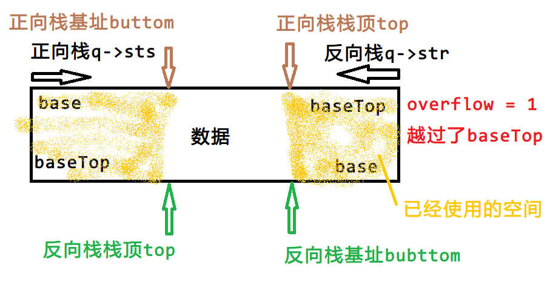
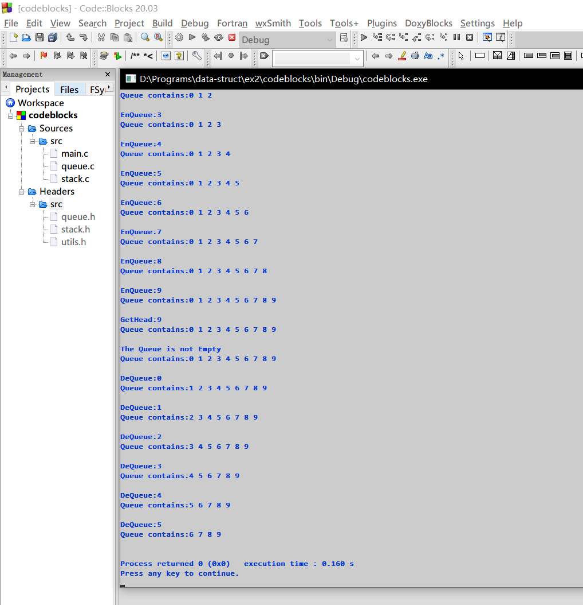

**问题分析**

> （1）用数组实现栈的基本操作，包括：
>
> Push 将元素压入栈顶
>
> Pop  获取并移除栈顶元素
>
> GetTop 获取栈顶元素
>
> StackEmpty 判断栈是否为空
>
> （2） 用栈实现先进先出队列的基本操作，包括：
>
> EnQueue 将元素插入到队列的尾
>
> DeQueue 获取并移除队头元素
>
> GetHead 获取队头元素
>
> QueueEmpty 判断队列是否为空
>
> 思考：如何利用两个栈，使连续的EnQueue / DeQueue效率最高？

**需要解决的关键问题**

1. 栈的储存方式和读写方式
2. 两个栈如何组合成一个队列
3. 如何利用两个栈，使连续的`EnQueue`/ `DeQueue`效率最高

**设计思想**

1. *栈的储存方式和读写方式*

   栈是一种在单一方向能够线性操作的数据结构，可以利用一段连续的内存空间来实现栈这种数据结构。

   写入栈即压入栈顶，读取栈即读取栈顶数据，然后可以用栈顶向栈底移动一个单位的方式删除栈顶数据。

2. *两个栈如何组合成一个队列*

   大约有下面几类方法：

   1. **方法一：**使用两个栈，一个负责`EnQueue`，另一个负责`DeQueue`。

      1. 每次`EnQueue` / `DeQueue`时，先将数据转移到对应的栈中，再读取栈顶元素
      2. 这样能够准确地得出正确的结果，但是时间效率太低，每一次`EnQueue` / `DeQueue`都会转移一次数据，即`EnQueue` / `DeQueue`的时间复杂度是$O(n)$，而且使用了两段空间，占用`MaxSize`的两倍内存。

   2. **方法二：**使用两个栈，维护两个栈的内容顺序相反。

      1. 每次入队头的数据进入栈`A`顶，然后把这个数据添加入栈`B`底，栈`B`内容后移；入队尾同理。
      2. 复杂度同方法一。

   3. **方法三：**使用“两个”栈，这两个栈共用一段储存空间。

      1. 通过将两个栈绑定，使得栈`A`在入栈的时候改变栈`B`的基址，从而实现数据和操作效果共享，而这两个栈在未绑定之时还是表现出栈的特性。

         这样的栈在使用中基址会不断在可用范围内循环，保证空间完全利用。

      2. 这样也能得出正确的结果，时间效率为$O(1)$，使用空间为`MaxSize`。

3. 如何利用两个栈，使**连续**的`EnQueue` / `DeQueue`效率最高

   使用**方法三**，连续`EnQueue` / `DeQueue`时间复杂度都是$O(1)$。

**储存结构**

栈的结构

```c
#define MaxSize 40               // 数组容量
typedef int DataType;
typedef struct Stack_t {
  DataType *base, *baseTop;      // 栈基址和栈最大地址指针（最大地址加一）
  struct Stack_t *reverse;       // 对应反向栈
  DataType *top, *bottom;        // 栈顶指针和栈底指针
  int overflow;                  // 是否栈顶已经回到 base 而栈底还没到 baseTop
  int direction;                 // 栈增加方向
} Stack;                         // 结构体类型名
```

队列结构

```c
typedef struct {
  Stack *sts, *str;       // 正向栈和反向栈
} Queue;
```

**涉及的操作**

```c
// stack.h
Stack *StackInit(Stack *src);
void StackDestroy(Stack *s);
int StackEmpty(const Stack *s);
int StackFull(const Stack *s);
int StackGetTop(const Stack *s, DataType *e);
int Push(Stack *s, const DataType *e);
int Pop(Stack *s, DataType *e);
void StackToArray(const Stack *s, DataType *seq);
size_t StackLength(const Stack *s);

// queue.h
Queue* QueueInit(Queue *q);
void QueueDestroy(Queue *q);
int QueueGetHead(const Queue *q, DataType *e);
int QueueEmpty(Queue *q);
int QueueEn(Queue *q, const DataType *e);
int QueueDe(Queue *q, DataType *e);
void QueueClear(Queue *q);
size_t QueueLength(Queue *q);
void QueueToArray(const Queue *q, DataType *seq);
```

**重要函数**

```c
// stack.c
Stack *StackInit(Stack *src) {
  // 未初始化
  if (!src) {
    src = (Stack *) malloc(sizeof(Stack));
    src->base = (DataType *) malloc(sizeof(DataType) * (MaxSize + 2));
    myassert(src->base);
    src->baseTop = src->base + MaxSize - 1;
    src->direction = 1;
    src->top = src->base - src->direction;
    src->bottom = src->base;
    src->overflow = 0;
    src->reverse = NULL;
    if (!sp_) sp_ = src;
    return src;
  }
  // 已经初始化，需要检查是否已经有反向栈
  if (src->reverse) return NULL;
  Stack *re = (Stack *) malloc(sizeof(Stack));
  src->reverse = re;
  re->reverse = src;
  re->direction = -src->direction;
  re->base = src->baseTop;
  re->baseTop = src->base;
  re->top = src->bottom;
  re->bottom = src->top;
  re->overflow = src->overflow;
  return re;
}

/**
 * 向栈插入一个元素
 * @param S 操作栈
 * @param e 操作数
 * @return 成功返回1，否则返回0
 */
int Push(Stack *s, const DataType *e) {
  if (StackFull(s)) return 0;
#ifdef DEBUG
  printf(LOGFMT "Push(%s, %d)\n", __func__, __LINE__, (sp_ == s ? "S" : "R"), *e);
#endif
  Stack *r = s->reverse;
  s->top += s->direction;
  if (r) r->bottom -= r->direction;
  if (s->top == s->baseTop + s->direction) {
    s->top = s->base;
    s->overflow = !s->overflow;
    r->overflow = s->overflow;
    if (r) r->bottom = r->baseTop;
    LOG("OverFlow!");
  }
  *s->top = *e;
  return 1;
}

/**
 * 从栈中弹出一个元素
 * @param S 操作栈
 * @param e 接受栈弹出的值
 * @return 成功返回1，否则返回0
 */
int Pop(Stack *s, DataType *e) {
  if (StackEmpty(s)) return 0;
  Stack *r = s->reverse;
  *e = *s->top;
#ifdef DEBUG
  printf(LOGFMT "Pop(%s, %d)\n", __func__, __LINE__, (sp_ == s ? "S" : "R"), *e);
#endif
  s->top -= s->direction;
  if (r) r->bottom += r->direction;
  if (s->top == s->base - s->direction) {
    s->top = s->baseTop;
    s->overflow = !s->overflow;
    r->overflow = s->overflow;
    if (r) r->bottom = r->base;
    LOG("OverFlow!");
  }
  return 1;
}

// queue.c
/**
 * 初始化队列
 * @param q 操作队列
 */
Queue *QueueInit(Queue *q) {
  if (!q) {
    q = (Queue *) malloc(sizeof(Queue));
    myassert(q);
  }
  q->sts = q->str = NULL;
  q->sts = StackInit(q->sts);
  q->str = StackInit(q->sts);
  return q;
}

/**
 * 入队操作，将元素插入队列，需要处理队列满的情况（队列元素数目最多为 MaxSize）
 * @param q 操作队列
 * @param e 插入的元素
 * @return 如果插入成功返回1，否则返回0
 */
int QueueEn(Queue *q, const DataType *e) {
  // 认真思考，从哪个栈Push元素，时间复杂度如何？能否降低
  // 直接向正向栈写入即可
  return Push(q->sts, e);
}

/**
 * 出队操作，从队列中取出一个元素
 * @param q 操作队列
 * @param e 接受出队元素
 * @return 如果成功取出返回1，否则返回0
 */
int QueueDe(Queue *q, DataType *e) {
  // 认真思考，从哪个栈Pop元素，时间复杂度如何？能否降低
  // 取反向栈的栈顶
  return Pop(q->str, e);
}

/**
 * 获取队列的一个数组拷贝，顺序为从队列头到队列尾
 * @param q 操作队列
 * @param seq 栈中元素的一个拷贝
 */
void QueueToArray(const Queue *q, DataType *seq) {
  // 取决于你的栈如何设计，元素存在哪个队列里。
  // 直接读取正向栈
  StackToArray(q->sts, seq);
}
```

**程序整体流程**



**运行结果**




**总结**

学习了栈和队列的相关算法，增强了数据结构的感知能力和解决问题的能力，以及数据建模的能力。