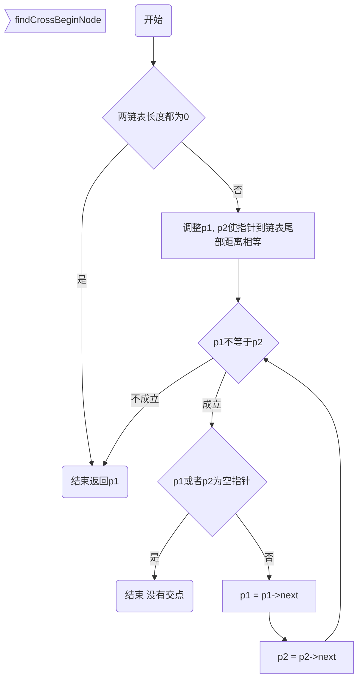

**找到链表交点**

```mermaid
graph TD
findCrossBeginNode>findCrossBeginNode]
start(开始)
endFunc(结束返回p1)
start --> if0{两链表长度都为0} -->|是| endFunc
if0 -->|否| line0[调整p1, p2使指针到链表尾部距离相等] --> 
if1{p1不等于p2} -->|成立| if2{p1或者p2为空指针} -->|是| endFunc2(结束 没有交点)
if1 -->|不成立| endFunc
if2 -->|否| line1[p1 = p1->next] --> line2[p2 = p2->next] --> if1

```

