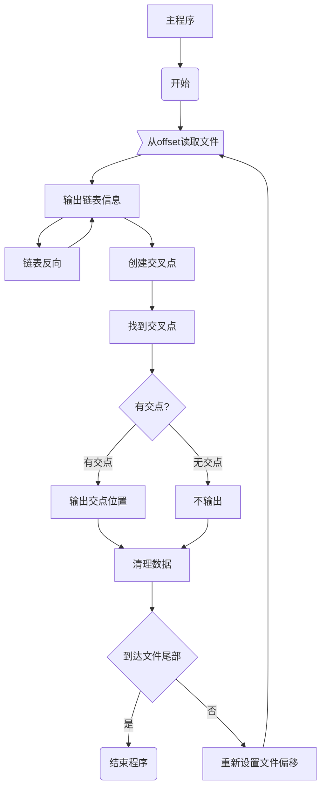
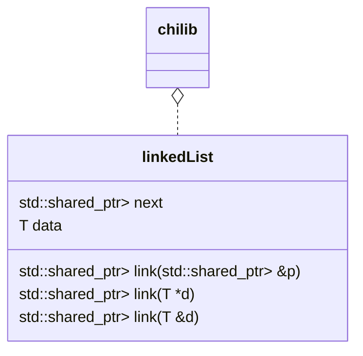
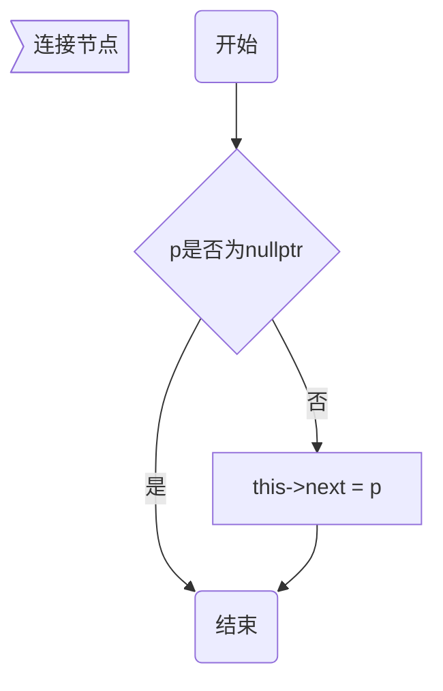
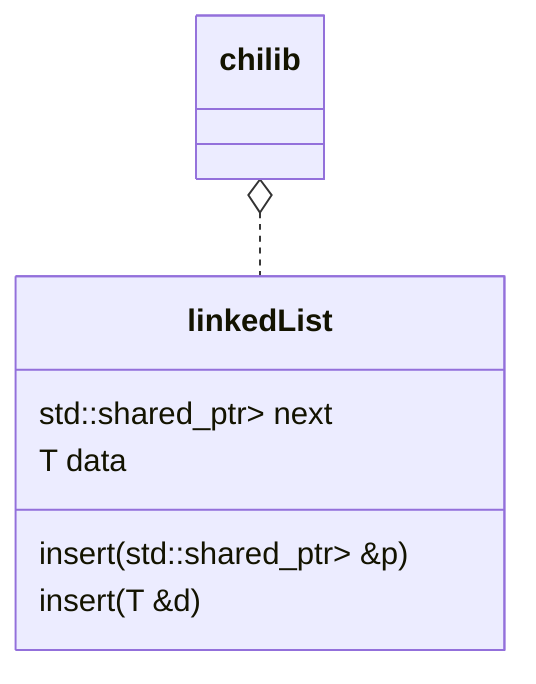
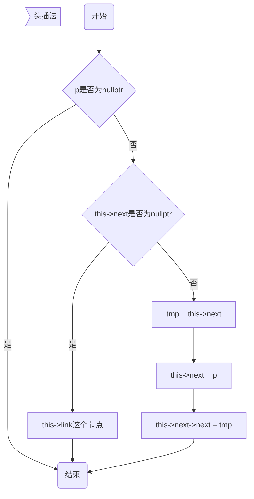
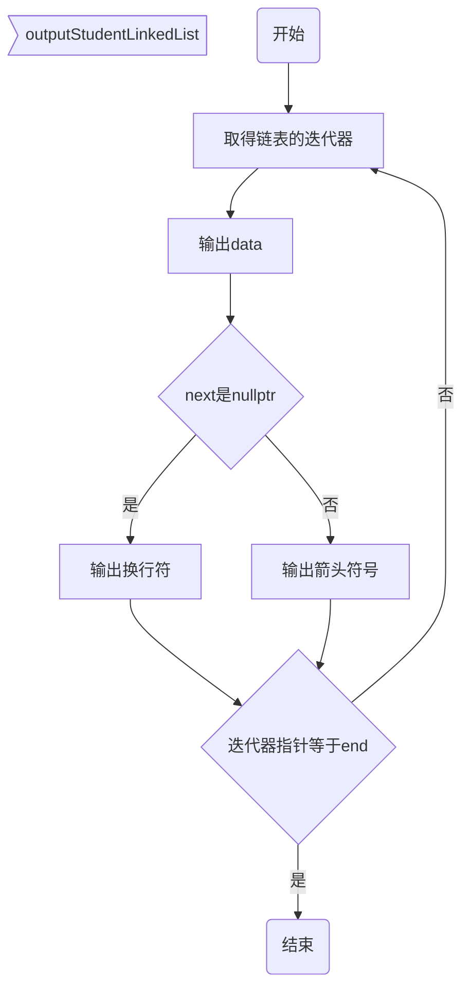
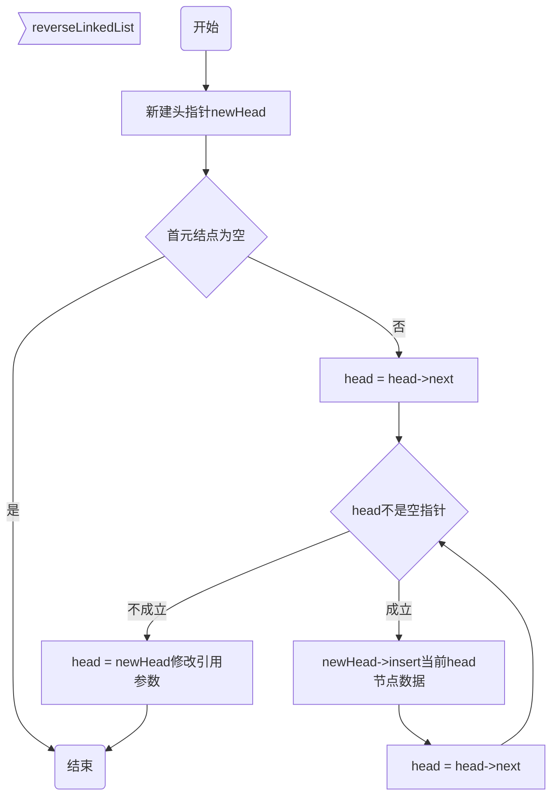
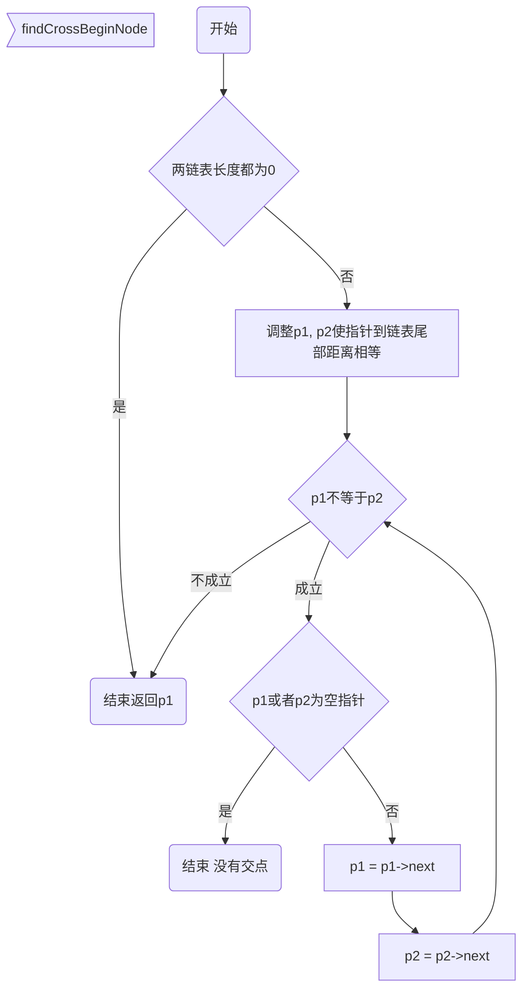

**问题描述**

学期结束，辅导员需要收集并整理两个班级同学的C语言课程成绩。请你为辅导员编写一个成绩录入统计程序，帮助辅导员更好地工作。

程序需求：

1. 存储链表：请按头插法将两个班的成绩存储到链表中。由于给出的输入总是升序的，此链表在存储后成绩将是降序的。
2. 反转链表：请将建立的两个降序存储的链表按升序进行反转。
3. 寻找链表交点：编程找出两个链表的第一个公共交点，你只能拿到交叉链表的两个头结点。

**问题分析**

1. *储存链表*：

   链表的储存是使用在计算机的内存中的一段可以不连续的区域，通过储存数据和指向下一个节点的指针的方式进行储存的一种线性结构。

   在创建这个链表的时候使用头插法，即每次把新的数据插入到头指针的前面，能够获得和输入数据顺序相反的链表。

2. *反转链表*：

   反转链表有两个思路，一是通过改变指针的指向方向，来原地改变链表的前后顺序。这样的方式效率高，也没有额外的内存消耗，是最优的算法。

   但是在本实验中本人使用了`C++`中的智能指针`shared_ptr`，使得节点不能储存自身的指针，而且在操作中有可能出现循环引用问题，造成资源无法自动正确释放，所以本人仍然使用了“头插法”来使链表反向。不过在“头插法”运行时，由于智能指针的特性，资源是一边赋值一边释放的，所以消耗了一些数据传输的时间，但是总内存量仍不变。相对于上面第一个算法只是略有不足，理论算法复杂度和空间复杂度仍然相同。

3. 寻找链表交点

   使用了逐个搜索的算法，即使用两个循环依次从头到尾检查两个链表指针是否指向同一内存。暂不知道有更加高效的解决方法。

**设计思想**

**储存结构**

链表的储存，我使用了这样的储存方式（见`./linked_list.hpp`）

```cpp
// 单向链表，C++智能指针实现
template<typename T>
class linked_list {
public:
  std::shared_ptr<linked_list<T>> next = nullptr;  // 指向下一个节点的指针
  T data{};                                        // 当前数据
// ......
};
```

设计特点：

1. 递归的结构设计，每一个指针`p`都可以单独表示一个链表。
2. 使用智能指针，防止内存泄露，方便内存管理。
3. 使用模板，链表的特性和数据本身脱离，具有更好的可移植性。
4. 代码规范，使用现代`C++`代码规范，方便代码管理和阅读。

**特别说明**

本程序运用到的`C++`标准库仅有`std::shared_ptr`，未使用包括`std::string`在内的`STL`标准库。

```cpp
using namespace chilib;
using std::ios;
// 声明：本程序没有使用 std::string
// using std::string;
```

**涉及的操作**

```cpp
// @prog    : 使用头插法读取文件数据到一个链表
// @rets    : 通过引用返回两个链表头指针和交叉节点，直接返回读取文件的offset
// @notice  : 读取完需要的数据或者EOF就表示文件结束
long readFileData(const string &filename, StudentList &class1, StudentList &class2, CrossLink &cross,
                  size_t offset = 0);
// 创建交叉链表
// 相交方法是将b中的前一结点指向a中的首个相交结点
// 使用了智能指针使得未被引用的数据自动删除
void createCrossLink(StudentList &head1, StudentList &head2, CrossLink &cross);
// @prog    : 找到相交的第一个结点
// @rets    : 返回找到的交点
StudentList findCrossBeginNode(StudentList &head1, StudentList &head2);
// @prog    : 输出该表的成绩情况
void outputStudentLinkedList(StudentList &head);
// @prog    : 翻转链表
// @rets    : 通过引用修改链表
void reverseLinkedList(StudentList &head);
// @prog    : 从对象生成一个节点
template<typename T>
auto linked_list_make(T &d);
// @prog    : 检查是否存在环
template<typename T>
bool linked_list_check_circulation(linked_list_p<T> &p);
// @prog    : 打印整条链表的数据
template<typename T>
void linked_list_print(linked_list_p<T> &head);
// ## 下面是 linked_list 的内部函数
  // @prog    : 得到链表尾部
  // @notice  : 只有自己一个节点的时候也返回nullptr
  std::shared_ptr<linked_list<T>> get_tail();
  // @prog    : 连接一个节点到this节点后面
  // @notice  : 这个传入的节点之后的数据被释放
  auto link(T &d);
  // @prog    : 接一个已经存在的链表串到本节点之后
  // @notice  : 本节点之后的数据释放
  //            参数节点之后的数据保留
  std::shared_ptr<linked_list<T>> link(std::shared_ptr<linked_list<T>> &p);
  // @prog     : 接一个已经存在的链表串到本节点之后
  // @notice   : 本节点之后的数据接到参数节点之后
  //             参数节点之后的数据保留到串中
  std::shared_ptr<linked_list<T>> append(std::shared_ptr<linked_list<T>> &p);
  // @prog    : 获取往下几个节点的指针
  // @notice  : 不能返回自己的指针
  std::shared_ptr<linked_list<T>> step(size_t s);
```

**程序整体流程**




**连接节点**






**头插法**





**遍历链表**



**翻转链表**



**找到链表交点**



**用户手册**


**总结**

学习了链表，并且用`C++`的智能指针对链表进行了实现。

练习了调试方法，增加了工程经验，提高了代码、架构水平。