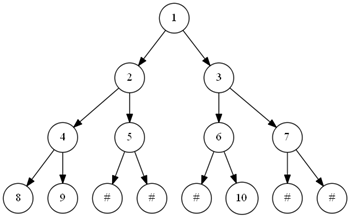
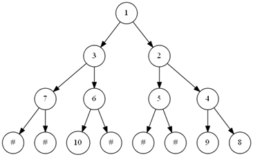

## 问题分析

### 题目1

按层次遍历建立二叉树，并输出该二叉树的前序遍历、 中序遍历和后序遍历的序列。



> “按照层次遍历”，实际上是按照满二叉树的宽度优先遍历方式把输入序列和节点一一对应，即按照这个顺序每访问一个节点就填入一个输入的节点的值，并且把`#`转成`-1`。

### 题目2

给定一棵二叉树，**路径**定义为从树的根节点到叶子结点的任意路径，求取该二叉树的最大路径和，**路径和**定义为一条路径中各节点的权值之和。

> 由于路径的定义是从树的根节点到叶子结点的任意路径，所以可以使用先序遍历，当遍历到叶子节点的时候向上寻找，计算路径和，最后比较得出最大路径和。

### 题目3

给定一棵二叉树，求取该二叉树的所有左子叶权重之和，左子叶被定义为二叉树叶子结点中属于左子树的节点。

> 同样可以使用先序遍历，当遇到左子叶的时候累计权重。

### 题目4

给定求取该树的镜像，即翻转该二叉树，如图1的结果如图2所示。并输出翻转后二叉树的中序遍历。



> 翻转二叉树可以使用先序遍历，把每次遍历到的节点左右互相交换，然后就可以继续访问左右节点。

## 详细设计

### 设计思想

#### 题目1

按层次遍历建立二叉树，并输出该二叉树的前序遍历、 中序遍历和后序遍历的序列。

> “满二叉树的遍历” 方式，也就是第$n$层有$2^{n-1}$个节点。
>
> 所以可以对一棵空树通过宽度优先遍历的方式逐步建树，然后删除多余的节点来节约空间。细节上的实践方法，大致是设置遇到空节点的时候是否入队来控制是否遍历一棵满树。
>
> 三种遍历方法都很简单，详见后文的流程图。

#### 题目2

给定一棵二叉树，**路径**定义为从树的根节点到叶子结点的任意路径，求取该二叉树的最大路径和，**路径和**定义为一条路径中各节点的权值之和。

> 使用先序遍历，当遍历到叶子节点的时候向上寻找，计算路径和，最后比较得出最大路径和。
>
> 由于数据结构中没有实现指向父节点的指针，所以需要一个栈来记录访问的路径。
>
> 每向下访问一次，就有一个指针入栈；这次遍历的函数结束的时候，让这个指针出栈，就能完成记录路径的功能。

#### 题目3

给定一棵二叉树，求取该二叉树的所有左子叶权重之和，左子叶被定义为二叉树叶子结点中属于左子树的节点。

> 同样可以使用先序遍历，当遇到左子叶的时候累计权重。
>
> 如何判断是左子叶呢？如果已经遍历到左子叶的时候才判断是不是子叶，那么就已经丢失了“左右”的信息。所以应在遍历到的节点判断左边子树是不是叶节点，并且在每次遍历的时候跳过叶子节点判断。

#### 题目4

给定求取该树的镜像，即翻转该二叉树，如图1的结果如图2所示。并输出翻转后二叉树的中序遍历。

> 翻转二叉树可以使用先序遍历，把每次遍历到的节点左右互相交换，然后就可以继续访问左右节点。
>
> 在交换的时候，由于本工程底层使用了智能指针，如果使用一般的交换方式有出现环的可能，还要避免这样的可能性。

### 储存结构和操作

#### 储存结构


```mermaid
classDiagram
	chilib o.. btree : 属于
	class btree {
		T data;
        bool is_in_threading = false;
        bool tag_left = false, tag_right = false;
        int height = -1;
        shared_ptr<btree> child_left = nullptr, child_right = nullptr;
        T &get_data()
        shared_ptr<btree> &get_left()
        shared_ptr<btree> &get_right()
        bool is_leaf()
        static void traversal_bfs(shared_ptr<btree> &tree, F1 const &on_item, F2 const &on_layer, bool includes_null = false)
		constexpr void traversal(const traversal_type &method, F const &callback, vector <btree<T>> *stack = nullptr)
	}
	
```

```mermaid
graph TD
n0((0))
n1((1))
n2((2))
n3((3))
n4((4))
n5((5))
n6((6))
n7((7))
n8((#))

n0 --> n1
n0 --> n2
n1 --> n3
n1 --> n4
n2 --> n5
n2 --> n7
n3 --> n6
n3 --> n8
```

### 涉及的操作

```cpp
/*!
   * 深度优先遍历（准备栈）
   * @tparam F bool(btree<T>&, vector<btree<T>>&)
   * @param callback 回调函数
   */
template<typename F>
constexpr void traversal_dfs(const traversal_type method, F const &callback) {
    vector <btree<T>> stack;
    // 利用闭包特性传递栈信息
    auto wrapper = [&stack, &callback](btree<T> &tr) -> bool {
        return callback(tr, stack);
    };
    traversal(method, wrapper, &stack);
}
/*!
   * 按照指定顺序遍历树
   * @tparam F
   * @param method [preorder, inorder, postoder]
   * @param callback bool(btree<T> &)
   * @return
   */
template<typename F>
constexpr void traversal(const traversal_type &method, F const &callback, vector <btree<T>> *stack = nullptr) {
    if (stack != nullptr) stack->emplace_back(*this);
    if (method == preother) {
        if (!callback(*this)) return;
        if (child_left != nullptr) child_left->traversal(method, callback);
        if (child_right != nullptr) child_right->traversal(method, callback);
    } else if (method == inorder) {
        if (child_left != nullptr) child_left->traversal(method, callback);
        if (!callback(*this)) return;
        if (child_right != nullptr) child_right->traversal(method, callback);
    } else if (method == postoder) {
        if (child_left != nullptr) child_left->traversal(method, callback);
        if (child_right != nullptr) child_right->traversal(method, callback);
        if (!callback(*this)) return;
    }
    if (stack != nullptr) stack->pop_back();
}
/*!
   * 广度优先遍历
   * @tparam F1 bool(btree<T>&, bool*)
   * @tparam F2 bool(btree<T>&, int&, bool*)
   * @param tree 目标树
   * @param on_item 每个元素的回调
   * @param on_layer 每一层的回调
   * @param includes_null=false 是否在元素回调中包含空节点
   */
template<typename F1, typename F2>
static void
traversal_bfs(shared_ptr<btree> &tree, F1 const &on_item, F2 const &on_layer, const bool includes_null = false) {
    if (tree == nullptr) return;
    vector<shared_ptr<btree> *> q;
    int height = 0;
    tree->height = height;
    shared_ptr<btree> *tree_temp = &tree;
    q.emplace_back(tree_temp);
    bool new_layer = false;
    bool end_all = false;
    while (!q.empty()) {
        shared_ptr<btree> *top = q.front();
        if (!on_item(*top, &end_all)) {
            if (end_all) return;
            q.pop_front();
            continue;
        }
        if (end_all) return;
        if (new_layer) {
            if (!on_layer(*top, height + 1, &end_all)) {
                if (end_all) return;
                continue;
            }
            new_layer = false;
            if (end_all) return;
        }
        if (includes_null && *top == nullptr) {
            q.pop_front();
            continue;
        }
        shared_ptr<btree> &left = (*top)->get_left(), &right = (*top)->get_right();
        if ((*top)->height > height) height = (*top)->height;
        auto push_if = [&q, &includes_null, &height](shared_ptr<btree> &child) {
            if (child != nullptr || includes_null) {
                shared_ptr<btree> *tmp = &child;
                if (!includes_null) (*tmp)->height = height + 1;
                q.emplace_back(tmp);
            }
        };
        push_if(left);
        push_if(right);
        q.pop_front();
        if (!q.empty()) {
            // 即将到下一层
            if (!includes_null && (*q[0])->height > height) {
                new_layer = true;
            }
        }
    }
}
```


### 程序流程

深度遍历操作（含栈）

```mermaid
graph TD
traversal>constexpr void traversal]
start(程序开始) --> stack0[如果栈存在非空则入栈]
stack0 --> 
switch{判断遍历类型}

stack1[如果栈存在且非空则出栈]

subgraph 先序遍历
s1_call[调用回调函数] -->
s1_left[调用非空的左子树的traversal] -->
s1_right[调用非空的右子树的traversal]
end
subgraph 中序遍历
s2_left[调用非空的左子树的traversal] -->
s2_call[调用回调函数] -->
s2_right[调用非空的右子树的traversal]
end
subgraph 后序遍历
s3_left[调用非空的左子树的traversal] -->
s3_right[调用非空的右子树的traversal] -->
s3_call[调用回调函数]
end
subgraph 回调判断
calling[调用回调函数] -->
if_continue{判断回调函数返回值}
if_continue -->|true| continue_yes[继续深入]
if_continue -->|false| continue_no[停止继续深入]
end


switch -->|先序遍历| s1_call
switch -->|中序遍历| s2_left
switch -->|后序遍历| s3_left

s1_call -.-> calling
s2_call -.-> calling
s3_call -.-> calling

s1_right --> stack1
s2_right --> stack1
s3_call --> stack1

s1_left -.->start
s2_left -.->start
s3_left -.->start
s1_right -.->start
s2_right -.->start
s3_right -.->start
```

广度优先遍历

```mermaid
graph TD
traversal_bfs>traversal_bfs]
start(程序开始)
endFunc(程序结束)
while0[队列是否为空]

start --> 
init_q[初始化队列] -->
push_root[将根节点加入队列] -->
while0

while0 -->|是| endFunc

while0 -->|否| get_top

subgraph while循环体内部
get_top[取出队列头top] -->
call_item[调用回调函数on_item] -->
if_item{判断返回值} -->|true| if_call_layer{是否设置可用调用on_layer}
if_call_layer -->|yes| on_layer[调用on_layer] --> if_layer_return{on_layer返回值}
if_call_layer -->|no| push_yes
if_layer_return -->|true| push_yes[可以将top的非空左右节点加入队列尾部]
if_layer_return -->|false| while0
if_item -->|false| push_no[不可以将top的非空左右节点加入队列尾部]
push_no --> pop_0[弹出队列头] --> while0
push_yes --> push_left[将top的非空左节点加入队列尾部]
push_yes --> push_right[将top的非空右节点加入队列尾部]
pop_1[弹出队列头]
push_left --> pop_1
push_right --> pop_1
pop_1 --> if_layer{队列头存在且头的层数大于当前层数}
if_layer -->|yes| call_layer[设置在下一次取出队列头的时候调用回调函数on_layer] --> while0
if_layer -->|no| while0
end
```


## 用户手册

> `chilib`是本人在数据结构课中，尝试使用`C++`语言和自己有限的知识实现`C++`库中部分`STL`库的功能的一个库。以下是`chilib::btree`的使用说明。

### 二叉树结构

本程序的二叉树数据结构以及对应类方法表示如下：

```mermaid
classDiagram
	chilib o.. btree : 属于
	class btree {
		T data;
        bool is_in_threading = false;
        bool tag_left = false, tag_right = false;
        int height = -1;
        shared_ptr<btree> child_left = nullptr, child_right = nullptr;
        T &get_data()
        shared_ptr<btree> &get_left()
        shared_ptr<btree> &get_right()
        bool is_leaf()
        static void traversal_bfs(shared_ptr<btree> &tree, F1 const &on_item, F2 const &on_layer, bool includes_null = false)
		constexpr void traversal(const traversal_type &method, F const &callback, vector <btree<T>> *stack = nullptr)
	}
	
```

```mermaid
graph TD
n0((0))
n1((1))
n2((2))
n3((3))
n4((4))
n5((5))
n6((6))
n7((7))

n0 --> n1
n0 --> n2
n1 --> n3
n1 --> n4
n2 --> n5
n2 --> n7
n3 --> n6
```

### 获取二叉树信息

```cpp
// 获取节点数据
T &get_data() { return data; }
// 获取左右子树
shared_ptr<btree> &get_left() { return child_left; }
shared_ptr<btree> &get_right() { return child_right; }
// 是否线索化
bool &get_is_threading() { return is_in_threading; }
// 线索化标志
bool &get_tag_left() { return tag_left; }
bool &get_tag_right() { return tag_right; }
// 获取当前高度
int &get_height() { return height; }
// 是否是叶子节点
bool is_leaf();
```

### 建立二叉树

```cpp
// 用 std::make_shared 建立节点
root = std::make_shared<btree<int>>(1);
// 用遍历方法建树
chilib::vector<int> line{1, 2, 3, 5, 6};
auto p = line.begin();
bt::traversal_bfs(root, [&p, &line](std::shared_ptr<bt> &tr, bool *end_all) -> bool {
    // 在 includes_null 情况下，需要设置 end_all 结束遍历
    if (tr != nullptr) return true;
    tr = std::make_shared<bt>(*p);
    ++p;
    if (p == line.end()) {
        *end_all = true;
        return false;
    }
    return true;
}, [](std::shared_ptr<bt> &tr, int height, bool *end_all) -> bool {
    // 这个函数是当遍历完一层之后触发的，height 表示下一层的高度
    // printf("height now: %d\n", height);
    return true;
    // includes_null 表示在遇到空节点的时候是否继续运行，设置为 true 则回调函数可以得到空节点的指针
}, true);
```

### 遍历二叉树

```cpp
// 前序、中序、后序遍历
auto print_order = [](std::shared_ptr<btree<int>> &tr) -> bool {
    // tr 就是当前遍历到的节点
    return true;
}
root->traversal_preorder(print_order);
root->traversal_inorder(print_order);
root->traversal_postorder(print_order);
// 深度优先遍历，会额外传一个遍历经过的栈
root->traversal_dfs([](bt &tr, chilib::vector<bt> &stack) -> bool {
    // 遇到叶子节点就向上计算经过的栈
    if (tr.is_leaf()) {
        printf("visit stack: ");
        for (auto &t : stack) printf("%d ", t.get_data());
        puts("");
    }
    return true;
});
// 宽度优先遍历
btree<int>::traversal_bfs(root,
                          [](std::shared_ptr<bt> &tr, bool *) -> bool {
                              // includes_null 默认为否，此时返回 false 会终止 bfs 向下继续遍历
                              return true;
                          },
                          [](std::shared_ptr<bt> &tr, int height, bool *end_all) -> bool { return true; }
                         );
```

### 删除二叉树

```cpp
root->traversal_preorder([](btree<int> &tr) -> bool {
    if (tr.get_data() == 9) {
        // 删除一些节点
        tr.get_left() = nullptr;
        tr.get_right() = nullptr;
    }
    return true;
});
// 删除整个二叉树
root = nullptr;
```

