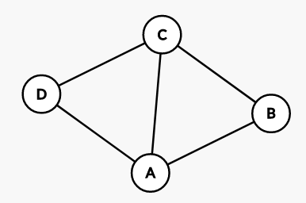
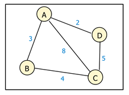

# TEST

## 题目分析

### 第一部分

#### 问题1：建图

本题中代码已经给出。

#### 问题2：判断图是否连通

从一个点开始遍历，如果能遍历到所有的点，则图连通。

#### 计算图中每个点的度

节点度是指和该节点相关联的边的条数，对于有向边是入度加出度，对无向图则是度。

#### 计算图的聚类系数

点的聚类系数是所有与它相连的顶点之间所连的边的数量，除以这些顶点之间可以连出的最大边数。图的聚类系数是所有点的聚类系数的均值。



举例，A的邻居为B、C、D，B、C、D之间的边有2条而B、C、D三个点之间可以连出的最大边数是3（两两相连），所以A的聚类系数是$\frac{2}{3}$；B有两个邻居，它们正好相连，所以B的聚类系数是1；同理，C的聚类系数是1；D的聚类系数是$\frac{2}{3}$。综上所述，这个图的聚类系数是$\frac{5}{6}$。

#### 若图连通，使用Dijkstra算法计算单源最短路径

#### 若图连通，计算图的直径、半径

`节点距离`：指的是两个节点间的最短路径的长度。

`Eccentricity`：这个参数描述的是从任意一个节点，到达其他节点的最大距离

`Diameter`：图中的最大的`Eccentricity`

`Radius`：图中的最小的`Eccentricity`



举例，Eccentricity(A) = ABC = 7;

Eccentricity(B) = BAD = 5;

Eccentricity(C) = CBA = 7;

Eccentricity(D) = DC = DAB = 5;

所以半径是5，直径是7。

### 第二部分

我们提供了深圳地铁的线路图，请同学们自行读取文件建图（文件格式在ppt中说明），并回答以下几个问题：

#### 这个图是连通的吗？

同第一部分一样，这里可以采用从一个点开始遍历，判断所有的点是否可达来判断图是否连通。

#### 线路图中换乘线路最多的站点是哪个？共有几条线路通过？

这实际上是求最大度的节点以及最大度的问题。

#### 该线路图的直径和半径是多少？

算法同第一部分。

#### 从大学城站到机场站最少需要多少时间？请打印最短路径上的站点名称

这是Dijkstra算法在寻找最短路径上的应用。

## 详细设计

### 设计思想

#### 第一部分

##### 问题1：建图

本题中代码已经给出。

##### 问题2：判断图是否连通

从一个点开始遍历，如果能遍历到所有的点，则图连通。判断图是否连通也有其他方法，比如并查集法：依次判断每一条边是否可以把每一个连通块合成一个连通块。考虑到代码复用性，这里采用遍历法。

##### 计算图中每个点的度

节点度是指和该节点相关联的边的条数，对于有向边是入度加出度，对无向图则是度。在本题中是无向图，故依次计算每一个点可以向外引出多少条路径即为这个点的度。记录最大度和对应节点。

##### 计算图的聚类系数

点的聚类系数是所有与它相连的顶点之间所连的边的数量，除以这些顶点之间可以连出的最大边数。图的聚类系数是所有点的聚类系数的均值。

只要计算出上面一段对应的数即可。注意可能舍去一些节点的值。

$聚类系数=\frac{n}{C^2_k} = \frac{n}{\frac{k(k-1)}{2}}$，其中$n$为边数，$k$为顶点的度。

##### 若图连通，使用Dijkstra算法计算单源最短路径

见代码。

##### 若图连通，计算图的直径、半径

见代码。

### 储存结构和操作

#### 储存结构

第一部分

```c
// 邻接表储存结构
typedef char vextype[20];
typedef struct {
  int N, E;         // N是顶点数，E是边数
  int **matrix;     //储存邻接矩阵
  vextype *vertex;  //存储节点的名字
} Graph;
```

