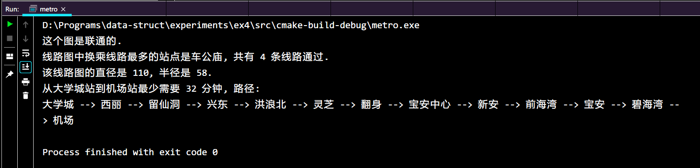

<center><b>哈尔滨工业大学(深圳)</b></center>


<center><span style="font-size: 300%">《数据结构》实验报告</span></center>


<center>实验四</center>

<center>图型结构及其应用</center>


| 学院 | <u>计算机科学与技术</u> |
| ---- | ----------------------- |
| 姓名 | <u>梁鑫嵘</u>           |
| 学号 | <u>200110619</u>        |
| 专业 | <u>计算机科学与技术</u> |
| 日期 | <u>2021-05-05</u>       |


# -

## 问题分析

### 第一部分

#### 问题1：建图

本题中代码已经给出。

#### 问题2：判断图是否连通

从一个点开始遍历，如果能遍历到所有的点，则图连通。

#### 计算图中每个点的度

节点度是指和该节点相关联的边的条数，对于有向边是入度加出度，对无向图则是度。

#### 计算图的聚类系数

点的聚类系数是所有与它相连的顶点之间所连的边的数量，除以这些顶点之间可以连出的最大边数。图的聚类系数是所有点的聚类系数的均值。


举例，A的邻居为B、C、D，B、C、D之间的边有2条而B、C、D三个点之间可以连出的最大边数是3（两两相连），所以A的聚类系数是$\frac{2}{3}$；B有两个邻居，它们正好相连，所以B的聚类系数是1；同理，C的聚类系数是1；D的聚类系数是$\frac{2}{3}$。综上所述，这个图的聚类系数是$\frac{5}{6}$。

#### 若图连通，使用Dijkstra算法计算单源最短路径

#### 若图连通，计算图的直径、半径

`节点距离`：指的是两个节点间的最短路径的长度。

`Eccentricity`：这个参数描述的是从任意一个节点，到达其他节点的最大距离

`Diameter`：图中的最大的`Eccentricity`

`Radius`：图中的最小的`Eccentricity`


举例，Eccentricity(A) = ABC = 7;

Eccentricity(B) = BAD = 5;

Eccentricity(C) = CBA = 7;

Eccentricity(D) = DC = DAB = 5;

所以半径是5，直径是7。

### 第二部分

我们提供了深圳地铁的线路图，请同学们自行读取文件建图（文件格式在ppt中说明），并回答以下几个问题：

#### 这个图是连通的吗？

同第一部分一样，这里可以采用从一个点开始遍历，判断所有的点是否可达来判断图是否连通。

#### 线路图中换乘线路最多的站点是哪个？共有几条线路通过？

这实际上是求最大度的节点以及最大度的问题。

#### 该线路图的直径和半径是多少？

算法同第一部分。

#### 从大学城站到机场站最少需要多少时间？请打印最短路径上的站点名称

这是Dijkstra算法在寻找最短路径上的应用。

## 详细设计

### 设计思想

#### 第一部分

##### 问题1：建图

本题中代码已经给出。

##### 问题2：判断图是否连通

从一个点开始遍历，如果能遍历到所有的点，则图连通。判断图是否连通也有其他方法，比如并查集法：依次判断每一条边是否可以把每一个连通块合成一个连通块。考虑到代码复用性，这里采用遍历法。

##### 计算图中每个点的度

节点度是指和该节点相关联的边的条数，对于有向边是入度加出度，对无向图则是度。在本题中是无向图，故依次计算每一个点可以向外引出多少条路径即为这个点的度。记录最大度和对应节点。

##### 计算图的聚类系数

点的聚类系数是所有与它相连的顶点之间所连的边的数量，除以这些顶点之间可以连出的最大边数。图的聚类系数是所有点的聚类系数的均值。

只要计算出上面一段对应的数即可。注意可能舍去一些节点的值。

$聚类系数=\frac{n}{C^2_k} = \frac{n}{\frac{k(k-1)}{2}}$，其中$n$为边数，$k$为顶点的度。

##### 若图连通，使用Dijkstra算法计算单源最短路径

见代码。

##### 若图连通，计算图的直径、半径

见代码。

### 储存结构和操作

#### 储存结构

第一部分

```c
// 邻接表储存结构
typedef char vextype[20];
typedef struct {
  int N, E;         // N是顶点数，E是边数
  int **matrix;     //储存邻接矩阵
  vextype *vertex;  //存储节点的名字
} Graph;
```

第二部分：链式前向星储存结构


第二部分：优先队列储存结构


#### 涉及的操作

**优先队列中：**

```cpp
  /*!
   * 上浮操作
   * @param index 操作节点
   */
  void shift_up(size_t index) {
    if (cmp(data[father(index)], data[index])) {
      std::swap(data[index], data[father(index)]);
      shift_up(father(index));
    }
  }

  /*!
   * 下沉操作
   * @param index 操作节点
   */
  void shift_down(size_t index) {
    if (left(index) >= data.length()) return;
    if (right(index) >= data.length()) {
      if (cmp(data[index], data[left(index)])) {
        std::swap(data[left(index)], data[index]);
        shift_down(left(index));
      }
      return;
    }
    if (cmp(data[right(index)], data[left(index)])) {
      if (cmp(data[index], data[left(index)])) {
        std::swap(data[left(index)], data[index]);
        shift_down(left(index));
      }
    } else {
      if (cmp(data[index], data[right(index)])) {
        std::swap(data[right(index)], data[index]);
        shift_down(right(index));
      }
    }
  }

  /*!
   * 向队列尾部添加元素
   * @param d 元素
   */
  void push(T d) {
    data.emplace_back(d);
    shift_up(data.length() - 1);
  }

  /*!
   * 取队列头元素
   * @return 元素引用
   */
  T &top() {
    empty_check();
    return data[0];
  }

  /*!
   * 弹出队列头元素
   */
  void pop() {
    empty_check();
    T back = data[data.length() - 1];;
    data.pop_back();
    if (data.empty()) return;
    data[0] = back;
    shift_down(0);
  }
```

**链式前向星中：**

```cpp
  /*!
   * 设置容器遍历的边起点节点
   * @param from 起点节点
   * @return 已经改变之后的链式前向星对象引用
   */
  linked_edges &set_from(int from) {
    // 并不线程安全呢
    m_from = from;
    return *(this);
  }

  /*!
   * 加单向边
   * @param from
   * @param to
   * @param weight
   * @param line 附加：第几条线
   */
  void add_edge(int from, int to, int weight, int line) {
    cnt++;
    (*edges)[cnt] = edge_node(to, weight, (*heads)[from], line);
    (*heads)[from] = cnt;
  }

  /*!
   * 取得第一个有边的节点
   * @return
   */
  int get_head_first() {
    int head_first = 0;
    while ((*heads)[head_first] == 0) head_first++;
    return head_first;
  }
```

**地铁图操作：**

```cpp
// 判断图是否联通
bool is_map_connected(chilib::linked_edges &edges) {
  chilib::vector<bool> visited(edges.get_node_size() + 1);
  int head_first = edges.get_head_first();
  // BFS
  chilib::vector<int> queue;
  queue.emplace_back(head_first);
  visited[head_first] = true;
  while (!queue.empty()) {
    int from = queue.pop_front();
    try {
      for (const auto &edge : edges.set_from(from)) {
        int to = edge.to;
        if (!visited[to]) {
          visited[to] = true;
          queue.emplace_back(to);
        }
      }
    } catch (std::out_of_range &e) {
      std::cerr << e.what() << " when from = " << from << std::endl;
      throw e;
    }
  }
  for (size_t i = 1; i <= edges.get_node_size(); i++)
    if (!visited[i]) {
//      printf("ID %d not visited!\n", i);
      return false;
    }
  return true;
}

// 找经过最多线路的站点
int find_most_exchanged(chilib::linked_edges &edges, int &max_degree) {
  int id = -1;
  for (size_t i = 1; i <= edges.get_node_size(); i++) {
    // degree 即为当前节点度
    int degree = 0;
    auto it = edges.set_from(i).begin();
    while (it != edges.end()) {
      ++it;
      degree++;
    }
    if (degree > max_degree) {
      // 取节点度最大值并且记录节点id
      max_degree = degree;
      id = i;
    }
  }
  return id;
}

void dijkstra(int start, chilib::linked_edges &edges,
              chilib::vector<int> &distance,
              chilib::vector<int> *path) {
  // 初始化 visited, path 和 distance 数组
  chilib::vector<bool> visited(edges.get_node_size() + 1);
  distance = chilib::vector<int>(edges.get_node_size() + 1);
  if (path) *path = chilib::vector<int>(edges.get_node_size() + 1);
  // 距离初始化为最大值
  for (auto &d : distance) d = METRO_LEN_MAX;
  // 虽然这两个优先队列用法一致，但是自己写的这个得开 -O2 性能才赶得上STL的...
  // std::priority_queue<node_order> q;
  chilib::priority_queue<node_order> q;
  // 记录起点距离
  distance[start] = 0;
  // 添加起点
  q.push(node_order(start, 0));
  while (!q.empty()) {
    // 取出当前可访问到的边的最小的边
    node_order top = q.top();
    q.pop();
    if (visited[top.pos]) continue;
    int from = top.pos;
    visited[from] = true;

    // 利用链式前向星容器遍历边
    for (const auto &edge : edges.set_from(from)) {
      int to = edge.to, weight = edge.weight;
      // 更新最短边数据
      if (distance[to] > distance[from] + weight) {
        distance[to] = distance[from] + weight;
        // 添加路径
        if (path) (*path)[to] = from;
        if (!visited[to]) {
          q.push(node_order(to, distance[to]));
        }
      }
    }
  }
}

// 计算ecc、直径、半径
void compute_ecc(chilib::linked_edges &edges, int &d, int &r) {
  d = 0, r = METRO_LEN_MAX;
  for (size_t i = 1; i <= edges.get_node_size(); i++) {
    int ecc = 0;
    chilib::vector<int> distance;
    dijkstra(i, edges, distance, nullptr);
    // ecc: 单源距离最大值
    for (size_t j = 1; j <= edges.get_node_size(); j++) {
      ecc = ecc > distance[j] ? ecc : distance[j];
    }
    // d: ecc 的最大值, r: ecc 的最小值
    d = d < ecc ? ecc : d;
    r = r > ecc ? ecc : r;
  }
}

// 主函数
int main() {
  // 配置
  // 打开这个开关，会使用Graphviz绘制整个地铁站的图像
  const bool draw_image = false;
  // 起点和目的地名称
  chilib::string station1_name = "大学城",
          station2_name = "机场";
//          station2_name = "深圳湾公园";
  // 文件名
  const char *metro_data = "metro.txt", *metro_name_data = "no2metro.txt";
  chilib::linked_edges edges(METRO_EDGES_MAX);
  chilib::vector<chilib::string> names;
  data_read_metro(metro_data, edges);
  data_read_metro_names(metro_name_data, names);
  printf("这个图%s联通的.\n", is_map_connected(edges) ? "是" : "否");
  int max_degree = 0;
  int most_exchanged = find_most_exchanged(edges, max_degree);
  printf("线路图中换乘线路最多的站点是%s, 共有 %d 条线路通过.\n", names[most_exchanged - 1].c_str(), max_degree);
  chilib::vector<int> distance;
  dijkstra(most_exchanged, edges, distance, nullptr);
// 打印最短长度信息
//  printf("distance: ");
//  for (const auto d : distance) {
//    printf("%d ", d == METRO_LEN_MAX ? -1 : d);
//  }
//  puts("");
  int d, r;
  compute_ecc(edges, d, r);
  printf("该线路图的直径是 %d, 半径是 %d.\n", d, r);
  int station1 = -1, station2 = -1;
  for (size_t n = 1; n < names.size(); n++) {
    if (names[n] == station1_name) station1 = n;
    if (names[n] == station2_name) station2 = n;
  }
  if (station1 < 0 || station2 < 0) {
    printf("找不到站点: %s 或者 %s!\n", station1_name.c_str(), station2_name.c_str());
    return 1;
  }
  // printf("station1: %d, %s; station2: %d, %s\n", station1, station1_name.c_str(), station2, station2_name.c_str());
  station1++, station2++;
  chilib::vector<int> path;
  dijkstra(station1, edges, distance, &path);
  printf("从%s站到%s站最少需要 %d 分钟, 路径: \n", station1_name.c_str(), station2_name.c_str(), distance[station2]);
  // 用栈把路径反过来
  chilib::vector<int> stack;
  int p = station2;
  while (p > 0) {
    stack.emplace_front(p - 1);
    if (p == station1) break;
    p = path[p];
  }
  // 打印路径
  for (const auto st : stack) {
    printf("%s", names[st].c_str());
    if (st != station2 - 1) printf(" --> ");
  }
  puts("");
  if (draw_image) draw(edges, names);
  return 0;
}
```

## 用户手册

本项目中使用了两部分自己写的库：`linked_edges`和`priority_queue`，使用说明如下：

### 使用说明 - chilib::priority_queue

#### 使用

1. 包含文件：`queue.hpp`
2. `chilib::priority_queue<int, chilib::greater<int>> q;`
3. `q.push(1);`
4. `q.pop();`

详细：

```cpp
//
// Created by Chiro on 2021/5/1.
//

#include <cstdio>
#include <cstdlib>
#include "chilib/queue.hpp"

int main() {
  chilib::priority_queue<int, chilib::less<int>> q;
  for (int i = 1000; i >= 0; i--) {
    int t = rand() % 1000;
    q.push(t);
    printf("pushed: %d\n", i);
  }
  while (!qs.empty()) {
    printf("%d\n", q.top());
	q.pop();
  }
  return 0;
}
```

#### 接口说明

大致和`STL`库一致，区别在~~性能比`STL`低~~、只会使用`chilib::vector`作容器。

```cpp
  /*!
   * 向队列尾部添加元素
   * @param d 元素
   */
  void push(T d);
  /*!
   * 取队列头元素
   * @return 元素引用
   */
  T &top();
  /*!
   * 弹出队列头元素
   */
  void pop();
  /*!
   * 判断队列是否为空
   * @return 是否为空
   */
  bool empty();
  /*!
   * 取得队列长度
   * @return 队列长度
   */
  size_t size();
```

### 使用说明 - chilib::linked_edges

#### 使用说明

包含文件：`linked_edges.hpp`。

示例：

```cpp
#include <cstdio>
#include "chilib/linked_edges.hpp"

int main() {
  // 最大节点数
  const int EDGES_MAX = 3;
  chilib::linked_edges edges(EDGES_MAX);
  // 添加边
  edges.add_edge(1, 2, 1);
  edges.add_edge(2, 1, 1);
  // 遍历边
  for (int from = 1; from < EDGES_MAX; from++)
    for (const auto &edge: edges.set_from(from))
      printf("%d ==%d==> %d\n", from, edge.weight, edge.to);
  return 0;
}
```

#### 接口说明

```cpp
  /*!
   * 构造函数
   * @param size 最大节点编号
   */
  explicit linked_edges(size_t size);
  /*!
   * 设置容器遍历的边起点节点
   * @param from 起点节点
   * @return 已经改变之后的链式前向星对象引用
   */
  linked_edges &set_from(int from);
  /*!
   * 加单向边
   * @param from
   * @param to
   * @param weight
   */
  void add_edge(int from, int to, int weight);
  /*!
   * 取得第一个有边的节点
   * @return
   */
  int get_head_first();
```

## 运行结果




## 总结

在本次实验中，手动构建了：

1. C++容器版链式前向星
2. 优先队列
3. 带路径记录的和链式前向星结合的Dijkstra算法

在构建这些小项目时收获了很多，比如如何提高代码复用性，如何巧妙适当地解耦代码逻辑，如何用特殊算法提升算法效率。

同时提高了自己的动手实践能力，为将来工作打下良好基础。