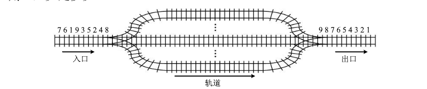
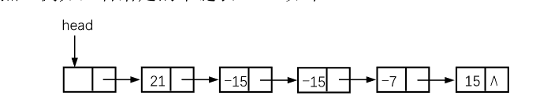
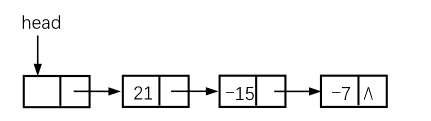

## 第一次作业 线性结构

1、简答题

1.1 简述线性链表头指针,头结点,首元结点(第一个结点) 三个概念的区别。

>1. **链表头指针**是指向链表第一个节点的指针
>
>2. **头结点**就是链表中的第一个节点，可以留空不储存信息，也可以储存附加的信息
>
>3. **首元结点**是链表中第一个储存数据的节点
>
>4. 如果设置了头结点，则
>
>   ```mermaid
>   graph LR
>   headp(链表头指针) -.->|指向| head(头结点) -->|连接| data(首元结点) -->|连接| data2(后续节点)
>   ```
>
>   如果未设置头结点，则
>
>   ```mermaid
>   graph LR
>   headp(链表头指针) -.->|指向| data(首元结点) -->|连接| data2(后续节点)
>   ```

1.2 在什么情况下用顺序表比链表好?

> 链表具有快速动态插入删除、线性查找的特点，由指针域和数据域组成单个节点，单个节点之间的链接组成链表。
>
> 而顺序表使用一整块连续的线性储存空间，线性查找。
>
> 所以在对于下面这几点情况下使用顺序表更好：
>
> 1. 没有快速插入删除数据的情况
> 2. 需要提高储存密度的情况，因为链表中指针域也需要占一部分空间
> 3. 对数据进行整块管理的情况，比如计算机中内存的管理
> 4. 对访问元素的性能要求很高的情况，因为链表的索引时间复杂度为$O(n)$，而顺序表索引时间复杂度为$O(1)$，比链表高不少

1.3 简述**队列**和**栈**这两种数据类型的相同点和差异处

> 相同点：
>
> 1. 都是线性结构储存，内部数据类型相同
> 2. 都支持动态增加或减小空间
> 3. 都在某端插入或者弹出数据，不能在中间操作数据
> 4. 插入和删除的时间复杂度都是$O(1)$
>
> 不同点：
>
> 1. 队列数据进出顺序为`FIFO`，先入先出，而栈是`LIFO`，先入后出
> 2. 队列的数据删除在尾部进行，栈的数据删除在栈顶进行
> 3. 应用场景不同，函数调用中参数的传递这样的操作栈更加合适，而广度优先搜索算法使用队列更加合适

1.4 设有如下图所示的火车车轨，入口到出口之间有n条轨道，列车的行进方向均为从左至右，列车可驶入任意一条轨道。现有编号为1～9的9列列车，驶入的次序依次是8,4,2,5,3,9,1,6,7。若期望驶出的次序依次为1至9，则n至少是多少？



> 本题目可以抽象为一个序列能分作多少条单调上升的子序列的问题。
>
> 可以这样思考，到中间轨道上的列车中，每条轨道上顺序必须是递增的，这样才能在轨道合并的时候完成合并而仍然单调上升。
>
> 所以可得需要中间的铁轨出现类似下面这样的情况
>
> |  1   |  2   |  4   |  8   |
> | :--: | :--: | :--: | :--: |
> |      |      |  3   |  5   |
> |      |      |  6   |  9   |
> |      |      |      |  7   |
>
> 共四条铁轨，$n \le 4$。

1.5现有队列Q与栈S，初始时队列Q中的元素依次是1,2,3,4,5,6（1在队头），栈S为空。若仅允许下列3种操作：

① 出队并输出出队元素；

② 出队并将出队元素入栈；

③ 出栈并输出出栈元素。

请分析是否能得到1,2,5,6,4,3和3,4,5,6,1,2两个输出序列,为什么？

> 1. `1, 2, 5, 6, 4, 3`步骤：
>    1. `Q`出队`2`次，输出`1, 2`
>    2. `Q`出队并且`S`入栈两次，此时`S`内容为`3, 4`（`4`在栈顶）
>    3. `Q`出队`2`次，输出`5, 6`
>    4. `S`出栈`2`次，输出`4, 3`
> 2. `3, 4, 5, 6, 1, 2`不能得到，因为如果数据入栈，则出栈值是递减的，而这串中的唯一的递减子序列`6， 1`后面的`2`不能由`Q`入栈`S`在输出或者直接输出得到，故不能得到这个序列

1.6假设按低下标优先存储整数数组`A(-3:8,3:5,-4:0,0:7)`时，第一个元素的字节存储地址是100，每个整数占4个字节。问：`A(0,4,-2,5)`的存储地址是什么？请简要说明计算方法。

>数组`A`的维度分别为：`[8, 5, 0, 7]`
>
>`A(0, 4, -2, 5)`距离第一个元素`A(-3, 3, -4, 0)`，每个维度相差：`[3, 1, 2, 5]`。从低维度往高维度计算，储存地址为：
>$$
>100+4\times (5 + 2\times 8 + 1\times 8\times 5 + 3\times 8\times 5\times 3) = 1784
>$$
>

2、数据结构设计及算法描述

给出一个停车场需求如下：

设停车场是一个可以停放`n`辆汽车的狭长通道，且<u>只有一个大门可供汽车进出</u>。汽车在停车场内按车辆到达时间的先后顺序，依次由北向南排列（<u>大门在最南端，最先到达的第一辆车停放在车场的最北端</u>），若车场内已停满`n`辆车，那么后来的车只能在门外的<u>便道上</u>等候，一旦有车开走，则排在便道上的第一辆车即可开入；当停车场内某辆车要离开时，*在它之后进入的车辆必须先退出车场为它让路*，待该辆车开出大门外，其他车辆再按*原次序*进入车场，每辆停放在车场的车在它离开停车场时必须按它<u>停留的时间长短</u>交纳费用。

试为停车场管理系统实现设计所需的数据结构；完成该管理系统需要哪些基本操作？文字描述算法基本思想。

> 1. 设计数据结构
>
>    停车场只有一个出入口，而且车之间不能互相交换顺序，故停车场的抽象结构可以描述为一个栈
>
> 2. 需要的基本操作
>
>    1. 入库，即让车经过大门到达所能进入的最北端
>    2. 出库，即让停车场内最南端的那辆车从车库门开出停车场
>    3. 验满，即判断停车场内是否已经有`n`辆车，而无法入库
>    4. 验空，即判断停车场内是否还有车，是否还能出库
>    5. 计费，计算每一辆车从入库到出库所用时间来计算费用

3、算法设计

 针对本部分的每一道题，要求：

（1） 采用`C`或`C++`语言设计数据结构；

（2） 给出算法的基本设计思想；

（3） 根据设计思想，采用`C`或`C++`语言描述算法，关键之处给出注释；

（4） 说明你所设计算法的时间复杂度和空间复杂度。

  可用类语言描述，给出伪码，无需上级调试。

3.1己知单向链表`L`是一个<u>递增有序表</u>,试写一**高效**算法,<u>删除表中值大于`min`且小于`max`的结点</u>(若表中有这样的结点),同时释放被删结点的空间,这里`min`和`max` 是两个给定的参数。

```c
typedef struct LinkedList_t {
    ElemType data;
    struct LinkedList_t *next;
} LinkedList;
// @program: 删除一段链表，释放内存
// @args:    链表
void LinkedListDelete(LinkedList *p) {
    LinkedList *t;
    while (p) {
        t = p;
        p = p->next;
        free(t);
    }
}
// @program: 删除表中大于 min 而且小于 max 的节点，释放内存
// @args:    递增有序链表, min, max
void LinkedListDeleteWithIn(LinkedList *li, ElemType min, ElemType max) {
    LinkedList *p = li, *start = NULL, *stop = NULL;		// 将会删除 (start, stop] (不包含 start 但是包含 stop)
    // 找 start
    while (p->next) {
        if (p->next->data > min) {
            start = p;
            break;
        }
    }
    // 找 stop
    while (p->next) {
        // 当 p 的下一个节点大于等于 max, 则节点 p 为 stop
        // 注意有可能找不到 stop, 需要继续判断
        if (p->next->data >= max) {
            stop = p;
            break;
        }
    }
    // 如果没找到 start 或者没找到 stop
    if (!p->next) {
        // 检查最后一个节点能不能成为 stop
        if (min < p->data && p->data < max) {
            stop = p;
        } else return;
    }
    // 删除 (start, stop]
    // 连最后一个节点也删除
    if (!stop->next) {
        LinkedListDelete(start->next);
        start->next = NULL;
        return;
    }
    // 删除中间一段，t 为中间这段的头头
    LinkedList *t = start->next;
    start->next = stop->next;
    stop->next = NULL;
    LinkedListDelete(t);
}
```


3.2 一个长度为$L\ (L\ge1)$的升序序列`S`，处在第$\frac{L}{2}$个位置的数称为`S`的中位数。例如，若序列$S_1=(11, 13, 15, 17, 19)$，则$S_1$的中位数是$15$。<u>两个序列的中位数是含它们所有元素的升序序列的中位数</u>。例如，若$S_2=(2, 4, 6, 8, 20)$，则$S_1$和$S_2$的中位数是$11$。现有两个<u>等长升序序列</u>`A`和`B`，试设计一个<u>在时间和空间两方面都尽可能高效的算法</u>，找出两个序列A和B的中位数。

```c
// @program: 找到两个序列的中位数
// @args:    等长序列1, 等长序列2, 单个序列的长度
// @note:    时间复杂度O(n), 空间复杂度O(1)
ElemType FindMid(ElemType *s1, ElemType *s2, size_t length) {
    ElemType mid;
    // 序列合并到中间长度就是中位数
    for (size_t i = 0; i < length; i++) {
        // 取两个序列中小的那个元素，然后对应序列指针后移
        if (*s1 < *s2) {
            mid = *s1;
            s1++;
        } else {
            mid = *s2;
            s2++;
        }
    }
  return mid;
}
```


3.3 用单向链表保存`m`个整数，结点的结构为：`(data, next)`，且$|data|\le n$（*n*为正整数）。现要求设计一个<u>**时间**复杂度尽可能高效</u>的算法，<u>对于链表中`data`的绝对值相等的结点，仅保留第一次出现的结点而删除其余绝对值相等的结点</u>。例如，若给定的单链表`head`如下：



则删除结点后的head为：



```c
typedef unsigned char u8;
#define myAbs(x) (x < 0 ? -x : x)
// @program: 删除 p 之后的下一个节点
// @args:    节点 p
void LinkedListDeleteNode(LinkedList *p) {
    if (!p || (p && !p->next)) return;
    LinkedList *n = p->next->next;
    free(p->next);
    p->next = n;
}
// @args: 链表, 正整数 n
void LinkedListDeleteAbs(LinkedList *head, n) {
    int index, offset;
    // 用空间换时间, 使用一个数组对需要排除的节点进行标注
	u8 mark[n / 8 + 1];
    // 初始化为 0，访问到哪一位为 1 表示需要排除
    LinkedList *p = head->next;
    while (p) {
        index = p->data / 8 + p->data % 8;
        offset = 1 << (p->data % 8);
        if (mark[index] & offset) {
            // 遇到要删除的节点就删除之
            LinkedListDeleteNode(p);
            p = p->next;
            continue;
        }
        // 标注
        mark[index] |= offset;
        p = p->next;
    }
}
```


3.4设有一个<u>双向链表</u>,每个结点中除有 `pred`、`data`和`next`这3个域外,还有一个<u>访问频度域</u>`freq`,在链表被启用之前,其值均初始化为零。每当在链表进行一次`LocateNode(L, x)`运算时,令元素值为`x`的结点中`freq`域的值加`1`,**并调整表中结点的次序**,使其按访问频度的递减序排列,以便使频繁访问的结点总是靠近表头。试写一符合上述要求的 `LocateNode` 运算的算法。

```c
typedef struct LinkedList_t {
    ElemType data;
    size_t freq;
    struct LinkedList_t *next, *pred;
} LinkedList;
void LocateNode(LinkedList *head, size_t x) {
    LinkedList *p = head, *q,;
    // 如果只找头结点就没那么麻烦了
    if (x == 0) {
        head->freq++;
        return;
    }
    size_t t = x;
    // 先找到这个节点的前一个节点
    t--;
    while (t) {
        if (!p->next) return;		// 找不到这个节点
        p = p->next;
        t--;
    }
    p->next->freq++;
    // 断开原来的位置，记录断下来的节点为 q
    q = p->next;
    p->next = q->next;
    p->next->pred = p;
    // 向前找到适当的位置然后插入
    while (p->freq == p->next->freq) {
        p = p->pred;
    }
    q->pred = p->pred;
    p->pred->next = q;
    q->next = p;
    p->pred = q;
}
```

3.5线性表中元素存放在数组 `A(1..n)`中,元素是整型数。分别写出**非递归**和**递归**算法求出数组 `A` 中的<u>最大和最小元素</u>，分析时间和空间复杂度。

```c
typedef int ElemType;

#define myMax(x, y) (x > y ? x : y)
#define myMin(x, y) (x < y ? x : y)

void FindMaxMin1(ElemType *data, size_t size, ElemType *max, ElemType *min) {
  // 二分法
  ElemType mx[2], mn[2];
  // 临界条件
  if (size == 2) {
    *max = myMax(data[0], data[1]);
    *min = myMin(data[0], data[1]);
    return;
  } else if (size == 1) {
    *max = data[0];
    *min = data[0];
    return;
  }
  FindMaxMin1(data, size / 2, mx, mn);
  FindMaxMin1(data + size / 2, size / 2 + size % 2, mx + 1, mn + 1);
  *max = myMax(mx[0], mx[1]);
  *min = myMin(mn[0], mn[1]);
}

void FindMaxMin2(ElemType *data, size_t size, ElemType *max, ElemType *min) {
  *max = *data, *min = *data;
  while (size) {
    if (*data > *max) *max = *data;
    if (*data < *min) *min = *data;
    data++;
    size--;
  }
}
```

>1. 时间复杂度
>   1. 递归算法中使用了二分法，则时间复杂度为$O(\log _2N)$
>   2. 非递归算法中直接线性查找，时间复杂度为$O(N)$
>2. 空间复杂度
>   1. 递归算法每次使用的辅助空间都是常数级别，所以空间复杂度为$O(\log _2N)$
>   2. 非递归算法没有和$N$有关的内存消耗，空间复杂度为$O(1)$