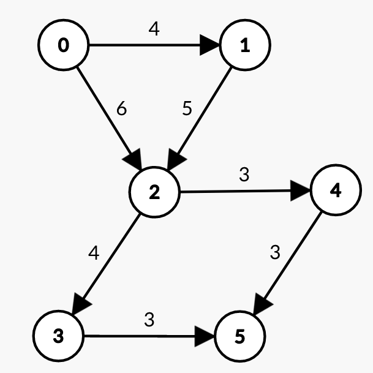

# 哈尔滨工业大学（深圳）2021 年春《数据结构》

<center>第二次作业 树型结构</center>

| 学号       | 姓名   |          | 成绩 |
| --------- | ------ | -------- | ---- |
| 200110619 | 梁鑫嵘  |          |      |

## 简答题

### -

带权图（权值非负，表示边连接的两顶点间的距离）的最短路径问题是找出从初始顶点到目标顶点之间的一条最短路径。假设从初始顶点到目标顶点之间存在路径，现有一种解决该问题的方法：

① 设最短路径初始时仅包含初始顶点，令当前顶点$u$为初始顶点；

② 选择<u>离$u$最近且尚未在最短路径中的一个顶点</u>$v$，**加入到最短路径中，修改当前顶点$u$ = $v$；**

③ 重复步骤②，直到$u$是目标顶点时为止。

请问上述方法能否求得最短路径？若该方法可行，请证明之；否则，请举例说明。

> 上述方法不能够得到最短路径。
>
> 如果上述算法没有②中的粗体部分，则上述算法的逻辑即$Dijkstra$算法的思想：每次加入距离起点“**最近**”的点。但是由于有了②中粗体部分的逻辑，使得每一次判断都会修改$u$使得每次选择的点都是和上一次选择的点最近的点。这样的算法会造成“短视”，每次都贪心地选择距离当前节点最近的下一个节点，无法保证最后得到的结果是最优解。例如这样的图：
>
> 
>
> 源节点为$1$，目标节点为$4$。
>
> 题目算法选择的路径为$1 \Rightarrow 6 \Rightarrow 2 \Rightarrow 5 \Rightarrow 3 \Rightarrow 4$，而最短路径应该为$1 \Rightarrow 3 \Rightarrow 4$。

### -

已知有6个顶点（顶点编号为0 ~ 5）的**有向带权图**$G$，其邻接矩阵$A$为上三角矩阵，按行为主序（行优先）保存在如下的一维数组中。

| 0    | 1    | 2    | 3    | 4    | 5    | 6    | 7    | 8    | 9    | 10   | 11   | 12   | 13   | 14   |
| ---- | ---- | ---- | ---- | ---- | ---- | ---- | ---- | ---- | ---- | ---- | ---- | ---- | ---- | ---- |
| 4    | 6    | ∞    | ∞    | ∞    | 5    | ∞    | ∞    | ∞    | 4    | 3    | ∞    | ∞    | 3    | 3    |

要求：

（1）写出图$G$的邻接矩阵$A$。

（2）画出有向带权图$G$。

（3）求图$G$的关键路径，并计算该关键路径的长度。

> 1. | \    | 0    | 1    | 2    | 3    | 4    | 5    |
>    | ---- | ---- | ---- | ---- | ---- | ---- | ---- |
>    | 0    | ∞    | 4    | 6    | ∞    | ∞    | ∞    |
>    | 1    |      | ∞    | 5    | ∞    | ∞    | ∞    |
>    | 2    |      |      | ∞    | 4    | 3    | ∞    |
>    | 3    |      |      |      | ∞    | ∞    | 3    |
>    | 4    |      |      |      |      | ∞    | 3    |
>    | 5    |      |      |      |      |      | ∞    |
>
> 2. 
>
> 3. $0 \Rightarrow 1 \Rightarrow 2 \Rightarrow 3 \Rightarrow 5$为关键路径，长度为$16$。

### -

使用$Prim$ （普里姆）算法求带权连通图的最小（代价）生成树（$MST$）。请回答下列问题。

（1）对右列图$G$，从顶点$A$开始求$G$的$MST$，依次给出按算法选出的边。

（2）图$G$的$MST$是唯一的吗？

（3）对任意的带权连通图，满足什么条件时，其$MST$是唯一的？


> 1. 算法顺序如下：
>    1. $A$联通的边中最小权值为$4(AD)$，选择节点$D$。已选定集合$\{A,D\}$，未选定集合$\{B, C, E\}$。
>    2. 已选定集合相关边中权值最小为$4(DE)$，选定节点$E$。已选定集合$\{A, D, E\}$，未选定集合$\{B, C\}$。
>    3. 已选定集合相关边中权值最小为$5(EC)$，选定节点$C$。已选定集合$\{A, C, D, E\}$，未选定集合$\{B\}$。
>    4. 已选定集合相关边中权值最小为$4(CB)$，选定节点$B$。已选定集合$\{A, D, E, B\}$，未选定集合$\{\}$，算法完成。
> 2. 是唯一的。
> 3. 在选择边以连接任意两个连通集合的时候只有唯一选择的图，$MST$是惟一的。

### -

已知图的邻接表如图所示，给出以顶点$A$为起点的一次深度优先（先深，$DFS$）和广度优先（先广，$BFS$）的搜索序列。


> 画出图来如下：
>
> 
>
> DFS: $B \Rightarrow A \Rightarrow F \Rightarrow E \Rightarrow C \Rightarrow D$
>
> BFS: $B \Rightarrow E \Rightarrow A \Rightarrow D \Rightarrow C \Rightarrow F$

## 算法设计

> （1） 采用C或C++语言设计数据结构；
>
> （2） 给出算法的基本设计思想；
>
> （3） 根据设计思想，采用C或C++语言描述算法，关键之处给出注释；
>
> （4） 说明你所设计算法的时间复杂度和空间复杂度。

### -

一个连通图采用邻接表作为存储结构，设计一个算法，实现从顶点v出发的深度优先遍历的非递归过程。

```c
#include <stdio.h>
#include <string.h>

typedef unsigned char u8;

// 邻接表结构
typedef struct {
  int edges[32][32];
  int tails[32];
} LinkedEdge;

// 加边操作
void add_edge_directed(LinkedEdge *e, int from, int to) {
  e->edges[from][e->tails[from]++] = to;
}

// 加双向边操作
void add_edges(LinkedEdge *e, int from, int to) {
  add_edge_directed(e, from, to);
  add_edge_directed(e, to, from);
}

// 递归式DFS遍历
int dfs(LinkedEdge *e, int u, int v, u8 *visit, int *path, int path_tail) {
  printf("visit: %d\n", u);
  if (u == v) return path_tail;
  for (int i = 0; i < e->tails[u]; i++) {
    int to = e->edges[u][i];
    u8 *vis = visit + (to / 8 + to % 8);
    u8 offset = 1 << (to % 8);
    if (*vis & offset) continue;
    path[path_tail++] = to;
    *vis |= offset;
    int tail = dfs(e, e->edges[u][i], v, visit, path, path_tail);
    if (tail) return tail;
    *vis &= ~offset;
    path_tail--;
  }
  return 0;
}

// 非递归式DFS遍历
int dfs_loop(LinkedEdge *e, int u, int v, u8 *visit, int *path) {
  int tail = 0;
  // 用栈的方式遍历，添加起点
  path[tail++] = u;
  // 记录起点已经访问
  visit[u / 8 + u % 8] |= 1 << (u % 8);
  while (tail) {
    // 取栈顶
    int from = path[tail - 1];
    printf("visit: %d\n", from);
    u8 will_pop = 1;
    // 到达目的地
    if (from == v) break;
    for (int i = 0; i < e->tails[from]; i++) {
      int to = e->edges[from][i];
      // 需要操作的对应字节
      u8 *vis = visit + (to / 8 + to % 8);
      // 需要操作的对应字节
      u8 offset = 1 << (to % 8);
      // 判断第 to 位是否置1
      if (!(*vis & offset)) {
        // visit 的第 to 位置1
        *vis |= offset;
        // 记录路径
        path[tail++] = to;
        will_pop = 0;
        // 记录一次就跳出，这样才叫DFS
        break;
      }
    }
    // 只有在找不到继续向下的路径的时候才会弹出（抛弃）这个节点
    if (will_pop) tail--;
  }
  // 返回路径长度，找不到则返回 0
  return tail;
}

int main() {
  LinkedEdge e;
  // 初始化为0就好
  memset((void *)&e, 0, sizeof(LinkedEdge));
  // 建立图，图同 2.3
  add_edges(&e, 0, 1);
  add_edges(&e, 0, 2);
  add_edges(&e, 1, 2);
  add_edges(&e, 1, 3);
  add_edges(&e, 3, 7);
  add_edges(&e, 1, 4);
  add_edges(&e, 2, 4);
  add_edges(&e, 2, 5);
  add_edges(&e, 5, 6);
  add_edges(&e, 4, 6);
  add_edges(&e, 6, 7);
  // 从 0 到 7
  int u = 0, v = 7;
  int path[512];
  u8 visit[40] = {0};
  // int path_tail = 0;
  // path[path_tail++] = u;
  // visit[u / 8 + u % 8] |= 1 << (u % 8);
  // path_tail = dfs(&e, u, v, visit, path, path_tail);
  int path_tail = dfs_loop(&e, u, v, visit, path);
  // 打印路径 
  printf("path: ");
  for (int i = 0; i < path_tail; i++) printf("%d ", path[i]);
  puts("");
  return 0;
}
```

> 本算法利用位运算稍微节省了一些运行内存空间，提高空间利用率。
>
> 查找边：$O(N)$，一共$N$个节点，所以时间复杂度：$O(N^2)$。
>
> 记录访问历史的$vis[N]$，记录路径的$path[N]$，所以空间复杂度$O(N)$。

### -

已知邻接表表示的有向图，请编程判断从第$u$顶点至第$v$顶点是否有简单路径，若有则印出该路径上的顶点。

```c
#include <stdio.h>
#include <string.h>

typedef unsigned char u8;

// 邻接表结构
typedef struct {
  int edges[32][32];
  int tails[32];
} LinkedEdge;

// 加边操作
void add_edge_directed(LinkedEdge *e, int from, int to) {
  e->edges[from][e->tails[from]++] = to;
}

// 加双向边操作
void add_edges(LinkedEdge *e, int from, int to) {
  add_edge_directed(e, from, to);
  add_edge_directed(e, to, from);
}

// 递归式DFS遍历
int dfs(LinkedEdge *e, int u, int v, u8 *visit, int *path, int path_tail) {
  printf("visit: %d\n", u);
  if (u == v) return path_tail;
  for (int i = 0; i < e->tails[u]; i++) {
    int to = e->edges[u][i];
    u8 *vis = visit + (to / 8 + to % 8);
    u8 offset = 1 << (to % 8);
    if (*vis & offset) continue;
    path[path_tail++] = to;
    *vis |= offset;
    int tail = dfs(e, e->edges[u][i], v, visit, path, path_tail);
    if (tail) return tail;
    *vis &= ~offset;
    path_tail--;
  }
  return 0;
}

// 非递归式DFS遍历
int dfs_loop(LinkedEdge *e, int u, int v, u8 *visit, int *path) {
  int tail = 0;
  // 用栈的方式遍历，添加起点
  path[tail++] = u;
  // 记录起点已经访问
  visit[u / 8 + u % 8] |= 1 << (u % 8);
  while (tail) {
    // 取栈顶
    int from = path[tail - 1];
    printf("visit: %d\n", from);
    u8 will_pop = 1;
    // 到达目的地
    if (from == v) break;
    for (int i = 0; i < e->tails[from]; i++) {
      int to = e->edges[from][i];
      // 需要操作的对应字节
      u8 *vis = visit + (to / 8 + to % 8);
      // 需要操作的对应字节
      u8 offset = 1 << (to % 8);
      // 判断第 to 位是否置1
      if (!(*vis & offset)) {
        // visit 的第 to 位置1
        *vis |= offset;
        // 记录路径
        path[tail++] = to;
        will_pop = 0;
        // 记录一次就跳出，这样才叫DFS
        break;
      }
    }
    // 只有在找不到继续向下的路径的时候才会弹出（抛弃）这个节点
    if (will_pop) tail--;
  }
  // 返回路径长度，找不到则返回 0
  return tail;
}

int main() {
  LinkedEdge e;
  // 初始化为0就好
  memset((void *)&e, 0, sizeof(LinkedEdge));
  // 建立图，图同 2.3
  add_edges(&e, 0, 1);
  add_edges(&e, 0, 2);
  add_edges(&e, 1, 2);
  add_edges(&e, 1, 3);
  add_edges(&e, 3, 7);
  add_edges(&e, 1, 4);
  add_edges(&e, 2, 4);
  add_edges(&e, 2, 5);
  add_edges(&e, 5, 6);
  add_edges(&e, 4, 6);
  add_edges(&e, 6, 7);
  // 从 0 到 7
  int u = 0, v = 7;
  int path[512];
  u8 visit[40] = {0};
  // int path_tail = 0;
  // path[path_tail++] = u;
  // visit[u / 8 + u % 8] |= 1 << (u % 8);
  // path_tail = dfs(&e, u, v, visit, path, path_tail);
  if (u == v) {
    puts("起点终点重合");
    return 0;
  }
  int path_tail = dfs_loop(&e, u, v, visit, path);
  if (!path_tail) {
    // 打印路径
    printf("path: ");
    for (int i = 0; i < path_tail; i++) printf("%d ", path[i]);
    puts("");
  } else {
    puts("找不到路径!");
  }
  return 0;
}
```

> 本算法利用位运算稍微节省了一些运行内存空间，提高空间利用率。
>
> 查找边：$O(N)$，一共$N$个节点，所以时间复杂度：$O(N^2)$。
>
> 记录访问历史的$vis[N]$，记录路径的$path[N]$，所以空间复杂度$O(N)$。

### -

有这样一个洞穴探宝问题：针对如右图所示的藏宝图，要找到从入口到出口的一条路径，该路径必须经过“食品”和“财宝”的地方以补充食物并得到财宝，但要绕开“强盗”居住地。（注：此题不要求写出C/C++代码，文字描述求解步骤即可）


> 1. 我们可以利用DFS遍历出从起点到终点的所有路径，并且对每条路径判断，排除不满足以下条件的路径：
>
>    1. 起点是入口，终点是出口
>    2. 路径经过食品和财宝
>    3. 路径不经过强盗
>
>    则可以筛选出满足条件的路径。
>
> 2. 在1.的基础上，我们可以做如下优化：
>
>    1. 在DFS过程中如果路径已经出现了强盗则立刻放弃当前路径
>    2. 筛选出一旦走了就没法经过食品和财宝的路径，走到这样的路径就立刻放弃当前路径
>    3. 事先使用贪心算法先尝试尽量靠近财宝和食品而远离强盗的路径，找到这样的一条路径则不用完全遍历路径
>
> 3. 时间复杂度：$O(N^2)$，空间复杂度：$O(N)$。

