# 数据结构复习笔记

## 线性表

### 概念

线性表包括：

1. 顺序表：线性表的顺序表示
2. 单链表：线性表的指针实现
3. 栈：线性表的特殊形式，只对表尾操作

### 顺序表

**动态分配方法：**

1. 初始分配空间（100）
2. 分配增量（10）
3. 可以用`realloc`更新基址来增大大小

**平均查找长度**：插入/删除一个数据元素平均移动表内一半元素

**查找时间复杂度：**

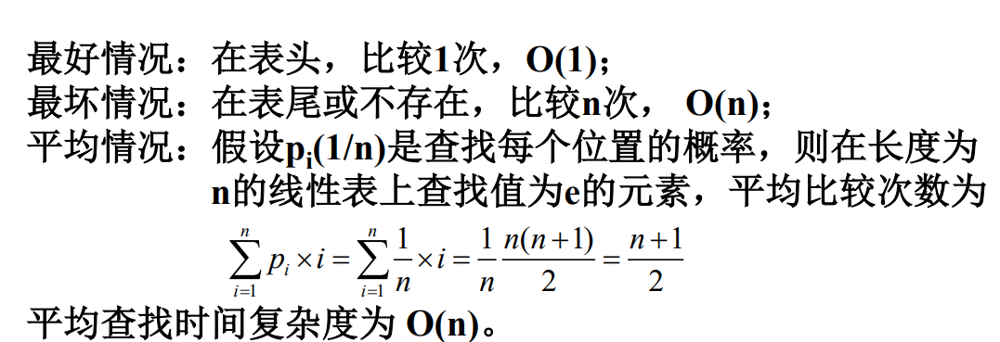

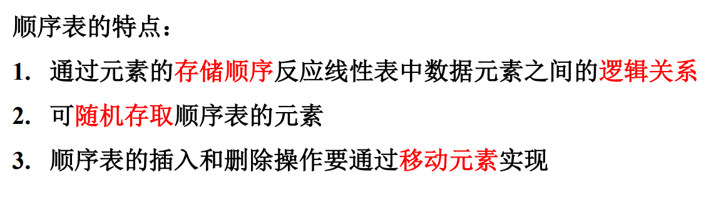

### 单链表

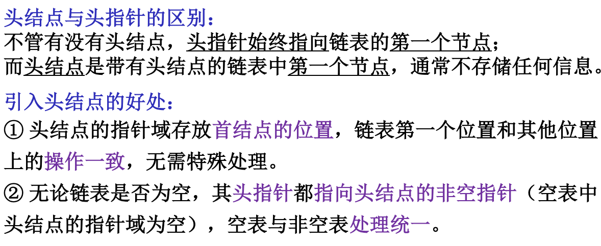

**特殊概念：**

1. 头结点（首节点）：第一个储存数据的节点，通常不储存信息
2. 第一个节点：指内存中储存的第一个位置的节点，可能是头结点也可不是。被**头指针**指向。
3. 头指针：指向**第一个节点**的指针

**时间复杂度：**

1. 插入和删除都是`O(1)`
2. 查找是`O(n)`
3. 合并算法`O(m+n)`或者`O(max(m, n))`

**空间复杂度：**

1. 插入删除都是`O(1)`
2. 两个有序的链表合并得到一个有序链表是`O(1)`，而对于顺序表为`O(m+n)`

**链表逆序算法：**实际就是从头到尾遍历，对遍历到的节点再用头插法插入头指针，时间`O(n)`，空间`O(1)`。

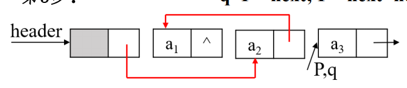


**判断链表是否有环：**快慢指针法

**线性链表，求倒数第K个数：**两个指针相差k，同时向后移动

**线性链表，求中间位置的元素：**前面指针移动速度是后面指针的两倍

**单向链表交叉问题：** 调整两个指针同时从两条链表出发，并且使得到链表尾部的长度相等

### 静态链表

借助数组实现静态的链表。

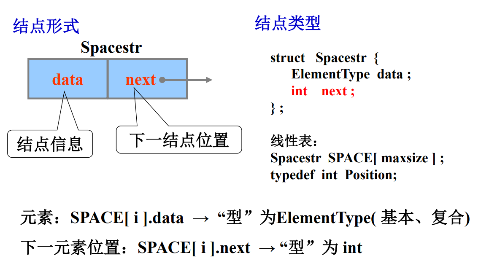

### 双向链表

### 环形链表

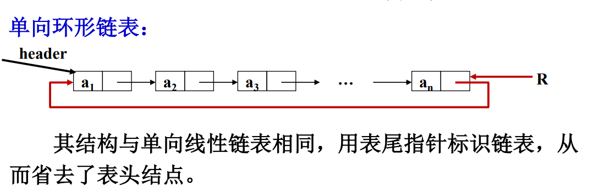

### 综合

**静态储存与动态储存**

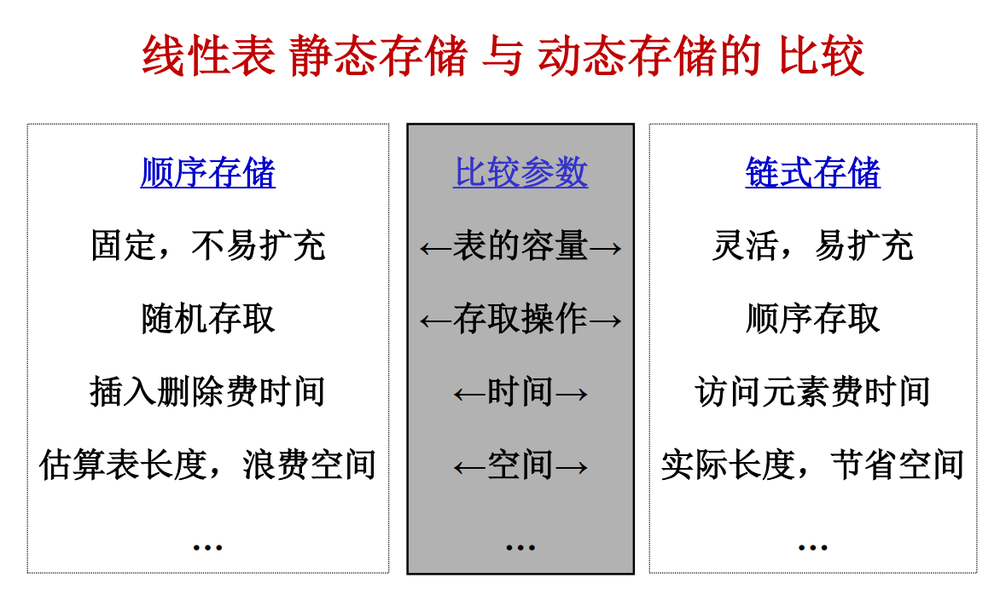

**链表优缺点**

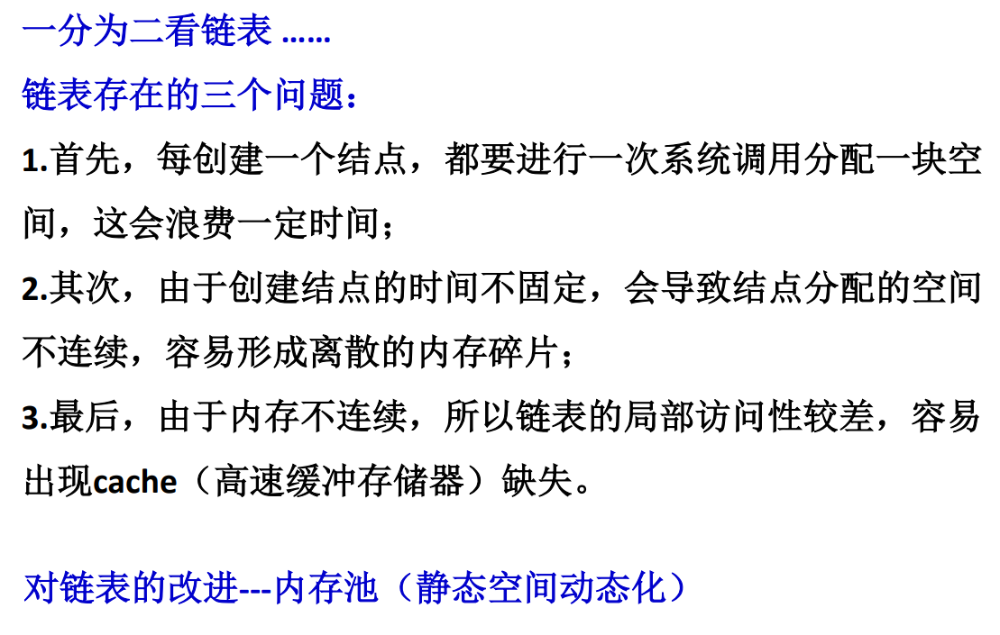

## 栈和队列

### 栈

**描述：**限定只在表尾进行插入和删除操作的线性表。后进先出（`LIFO`）结构。

**结构**

1. 顺序储存
   1. 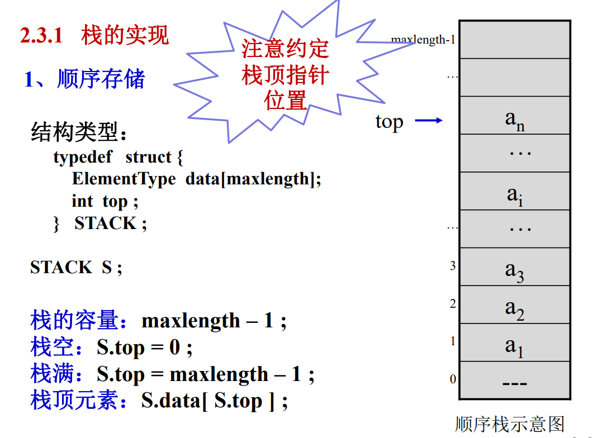
   2. 这里约定了栈顶`top`指向栈顶元素，而不是栈顶的下一个元素
   3. 栈是否为空，按照这个约定则为`top == 0`
2. 链式储存
3. 共享栈
   1. 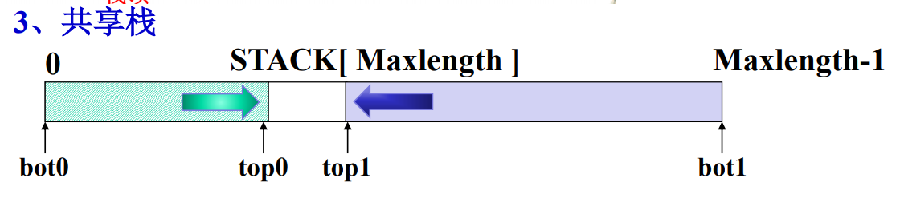

**为什么要设计栈**

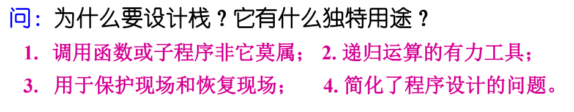

**栈的不可能出现的输出序列**

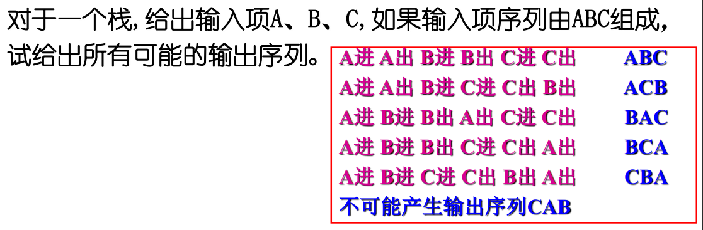

**汉诺塔问题**

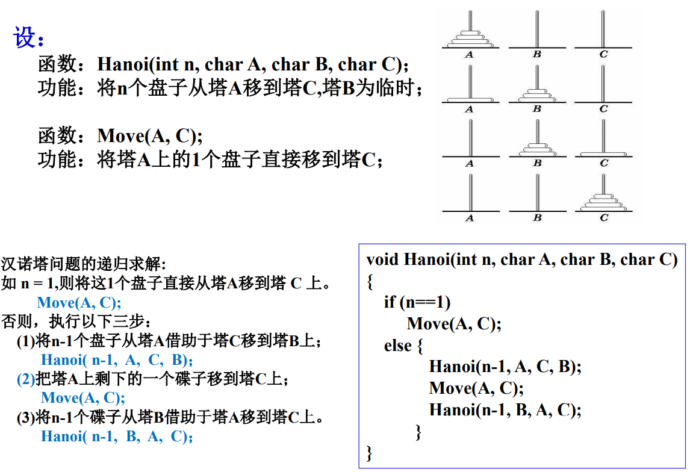

**进制转换**

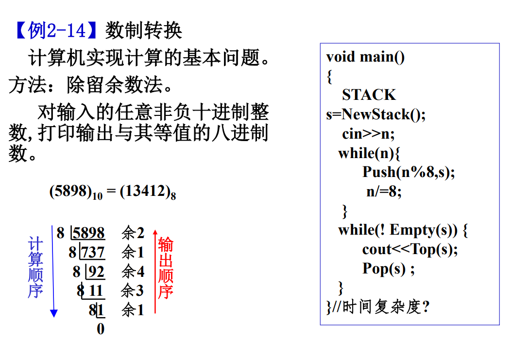

**表达式求值**

1. 种类：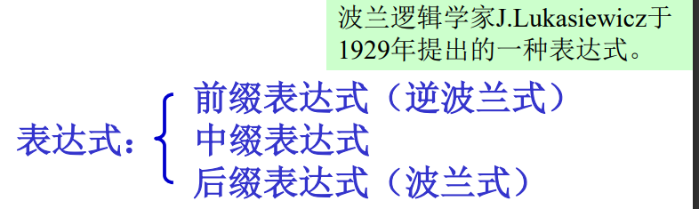
2. 高级语言中，采用类似自然语言的中缀表达式，但计算机 对中缀表达式的处理是很困难的，而对后缀或前缀表达式则显得非常简单。

### 队列

队列是对线性表的插入和删除操作加以限定的另一种限定型数据结构。

**假溢出：**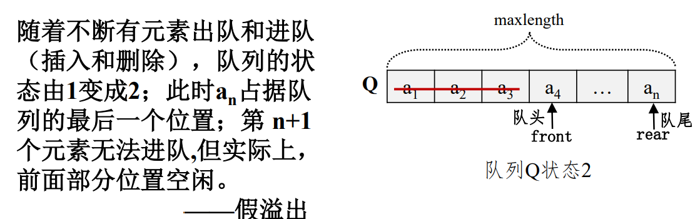

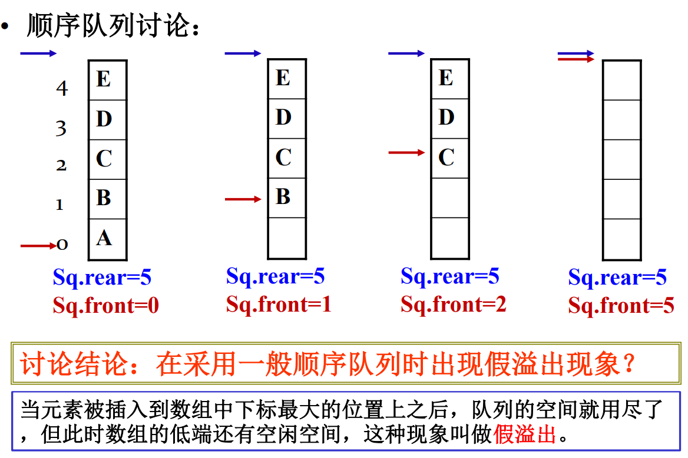

**队列的应用**

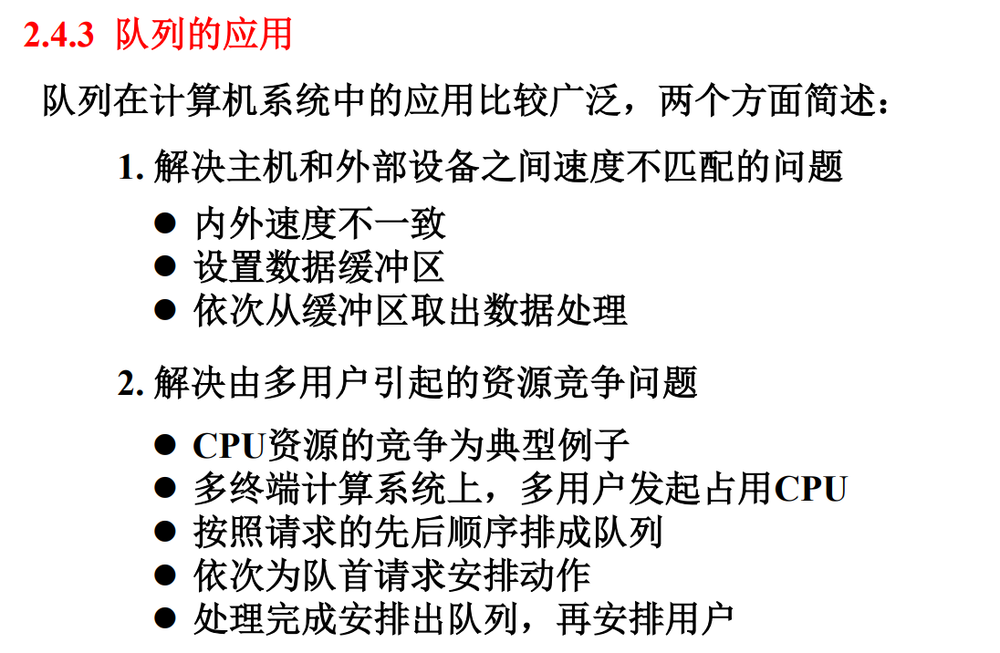

### 串

#### 模式匹配算法

**枚举法**

1. 最好情况下，最开头的字符失配，平均`O(m+n)`
2. 最坏情况，最后一个字符失陪配，平均`O(m*n)`

**KMP算法**

```cpp
void cal_next(char *str, int *next, int len) {
  next[0] = -1;  // next[0]初始化为-1，-1表示不存在相同的最大前缀和最大后缀
  int k = -1;  // k初始化为-1
  for (int q = 1; q <= len - 1; q++) {
    // 如果下一个不同，那么k就变成next[k]，
    // 注意next[k]是小于k的，无论k取任何值。
    while (k > -1 && str[k + 1] != str[q]) {
      k = next[k];  //往前回溯
    }
    if (str[k + 1] == str[q]) {  //如果相同，k++
      k = k + 1;
    }
    next[q] = k;
    // 这个是把算的k的值（就是相同的最大前缀和最大后缀长）赋给next[q]
  }
}
int KMP(char *str, int slen, char *ptr, int plen) {
  int *next = new int[plen];
  cal_next(ptr, next, plen);  //计算next数组
  int k = -1;
  for (int i = 0; i < slen; i++) {
    // ptr和str不匹配，且k>-1（表示ptr和str有部分匹配）
    while (k > -1 && ptr[k + 1] != str[i]) k = next[k];  //往前回溯
    if (ptr[k + 1] == str[i]) k = k + 1;
    if (k == plen - 1) {
      // 说明k移动到ptr的最末端
      // cout << "在位置" << i-plen+1<< endl;
      // k = -1;  //重新初始化，寻找下一个
      // i = i - plen + 1;
      // i定位到该位置，外层for循环i++可以继续找下一个
      // （这里默认存在两个匹配字符串可以部分重叠）
      return i - plen + 1;  //返回相应的位置
    }
  }
  return -1;
}
```

### 数组

#### 数组的压缩储存

**特殊矩阵**

1. 对称矩阵
2. 带状矩阵
3. 稀疏矩阵
   1. 稀疏矩阵三元组求转置
   2. 数组的链接式储存：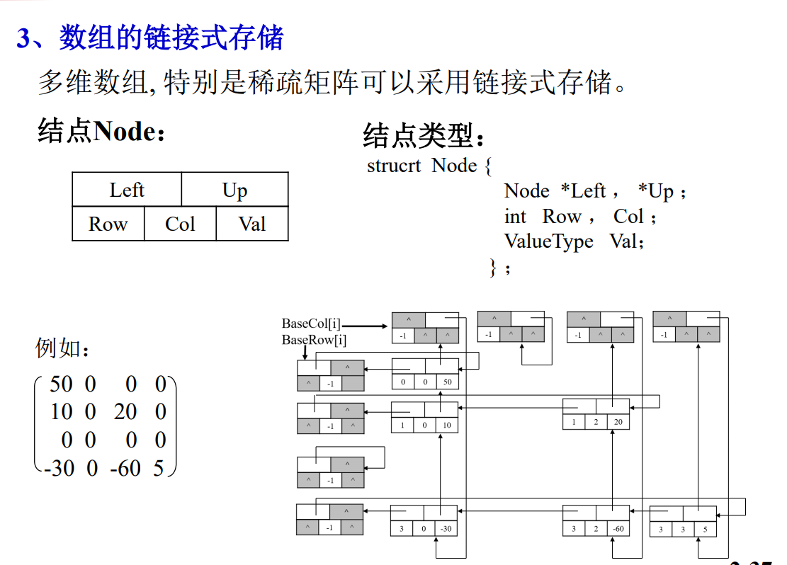

### 广义表

广义表是线性表的一种推广结构，线性表要求是相同的数据元素，而广义表中的<u>元素可以取不同类型</u>，可以是最基本的不可再分割的“原子”，也可以是广义表本身。广义表是由<u>零个原子，或若干个原子或若干个广义表组成的有穷序列</u>。

**结论：**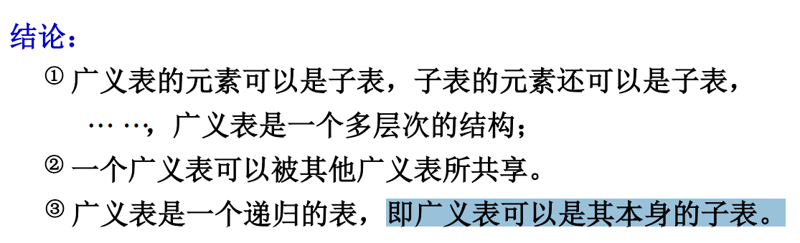

**操作：**

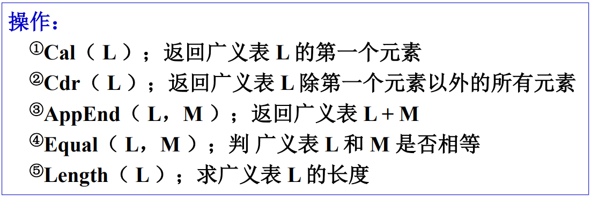

**储存结构**

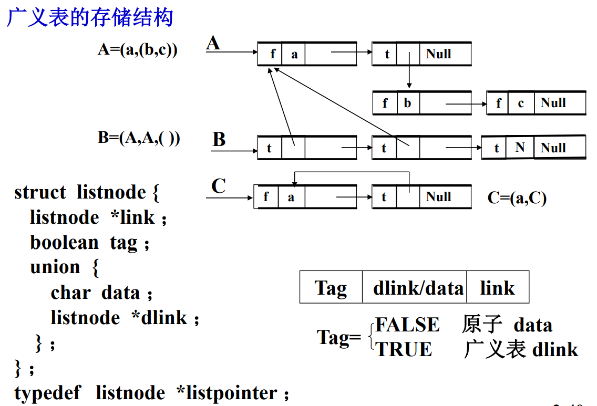

### 线性表总结

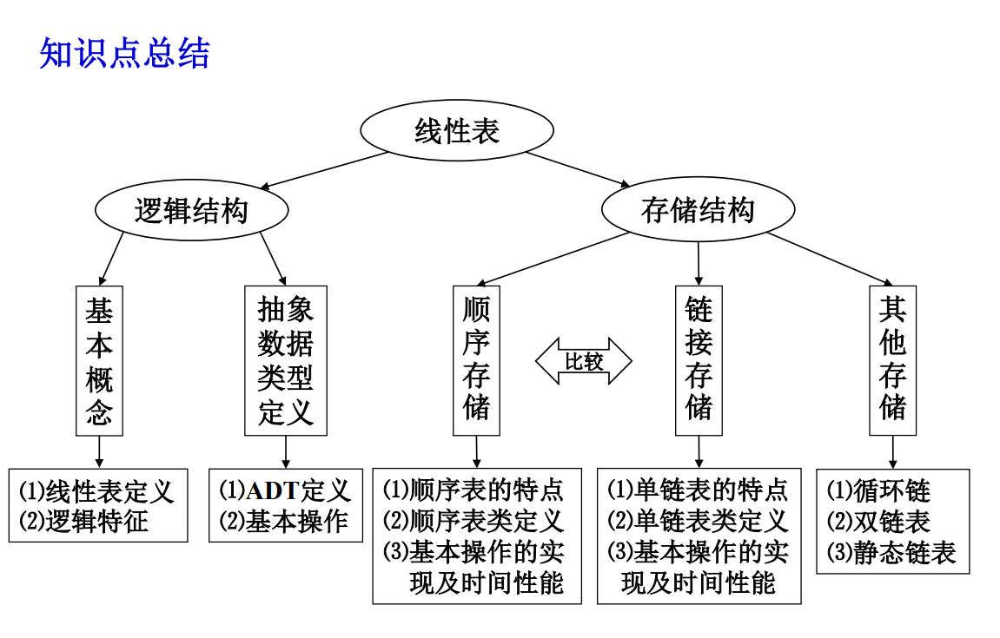

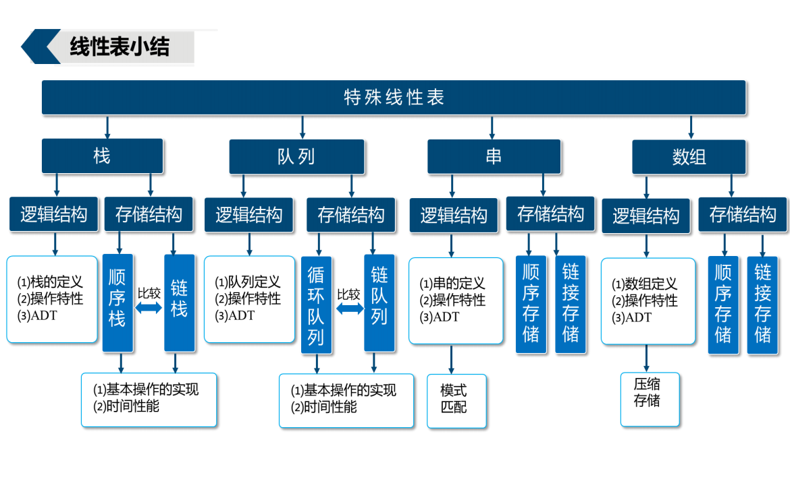

## 树

### 二叉树

#### 性质/概念

1. 在二叉树中第$i$层的结点数最多为$2^{i-1}$（$i \ge 1$）。

2. 高度为$k$的二叉树其结点总数最多为$2^{k－1}$（$k \ge 1$）。

3. 对于任意非空二叉树，`叶子节点数量 = 度数为2的节点数量 + 1`
   $$
   n_0 = n_2 + 1
   $$

4. 满二叉树：深度为$k$且有$2^k-1$个节点的树。（属于特殊的完全二叉树）

5. 完全二叉树：深度为$k$的，有$n$个结点的二叉树，当且仅当其每个 结点都与深度为$k$的满二叉树中编号从$1$至$n$的结点一一对应， 称之为完全二叉树。

   1. 具有 n 个结点的完全二叉树的深度为$\lfloor \log_2n \rfloor + 1$。

6. n 个结点的二叉树中，共有 n+1 个空链接域

#### 遍历

**原则：**左孩子结点一 定要在右孩子结点之前被访问。

**由两个遍历顺序确定二叉树**

1. 先序+后序不能确定一棵二叉树：

   > 中序遍历可以与前序遍历、后序遍历和层次遍历中的任意一个来构建唯一的二叉树，而后三者两两搭配或者是三个一起上都无法创建一颗唯一的一颗二叉树，原因是先序、后序、层次遍历均是提供根节点，作用是相同的，都必须<u>由中序遍历来区分出左子树与右子树</u>，所以中序遍历与后序遍历可以唯一确定一棵二叉树

2. 方法

   1. 先找中序遍历，从而找出当前子树的根
   2. 分出左右子树
   3. 递归调用

**二叉树遍历的非递归过程**

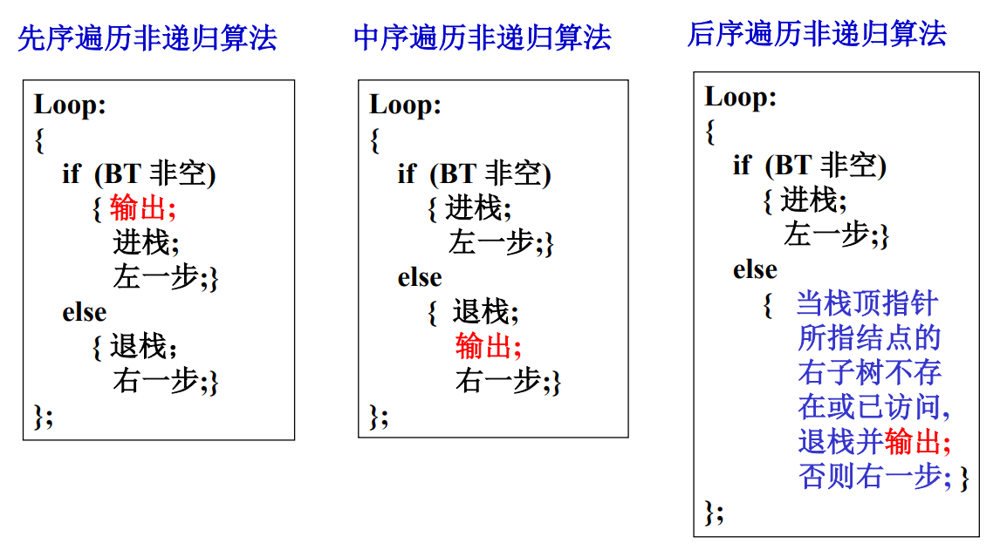

#### 线索二叉树

### 堆

如果一棵完全二叉树的任意一个非终端结点的元素都不小于其左儿子结点和右儿子结点（如果有的话）的元素， 则称此完全二叉树为最大堆。 同样，如果一棵完全二叉树的任意一个非终端结点的 元素都不大于其左儿子结点和右儿子结点（如果有的话） 的元素，则称此完全二叉树为最小堆。

**特点：**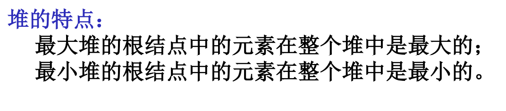


## 一些问题

### 原地合并？

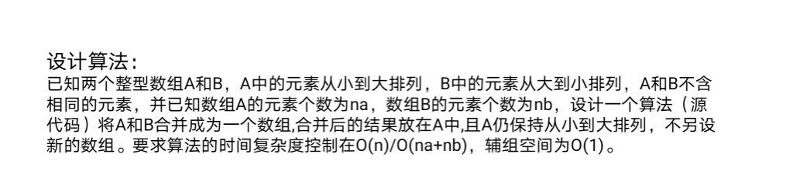

## 排序算法

### 相关概念

**稳定**：如果a原本在b前面，而a=b，排序之后a仍然在b的前面。

**不稳定**：如果a原本在b的前面，而a=b，排序之后 a 可能会出现在 b 的后面。

**时间复杂度：**一般情况下，算法中<u>基本操作重复执行的次数</u>是问题规模n的某个函数，用T(n)表示，若有某个辅助函数f(n),使得当n趋近于无穷大时，T（n)/f(n)的极限值为不等于零的常数，则称f(n)是T(n)的同数量级函数。记作T(n)=Ｏ(f(n)),称Ｏ(f(n)) 为算法的渐进时间复杂度，简称时间复杂度。
上面这一段解释是很规范的，但是对于非专业性的我们来说并不是那么好理解，说白了时间复杂度就是时间复杂度的计算<u>并不是计算程序具体运行的时间，而是算法执行语句的次数</u>。通常我们计算时间复杂度都是计算最坏情况 。
**最坏时间复杂度和平均时间复杂度**：
最坏情况下的时间复杂度称最坏时间复杂度。一般不特别说明，讨论的时间复杂度均是最坏情况下的时间复杂度。
这样做的原因是：最坏情况下的时间复杂度是算法在任何输入实例上运行时间的上界，这就保证了算法的运行时间不会比任何更长。
**平均时间复杂度：**是指所有可能的输入实例均以等概率出现的情况下，算法的期望运行时间。设每种情况的出现的概率为pi,平均时间复杂度则为sum(pi*f(n))

分作**两大类**：

> **非线性时间比较类排序**：通过<u>比较</u>来决定元素间的相对次序，由于其时间复杂度<u>不能突破O(nlogn)</u>，因此称为非线性时间比较类排序。
>
> **线性时间非比较类排序**：<u>不通过比较</u>来决定元素间的相对次序，它可以突破基于比较排序的时间下界，以线性时间运行，因此称为线性时间非比较类排序。 


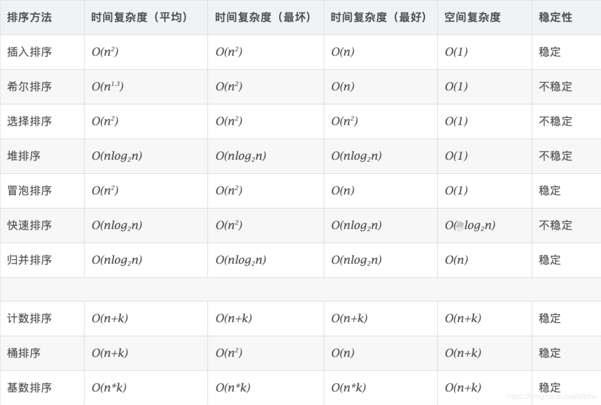

### 时间复杂度分析

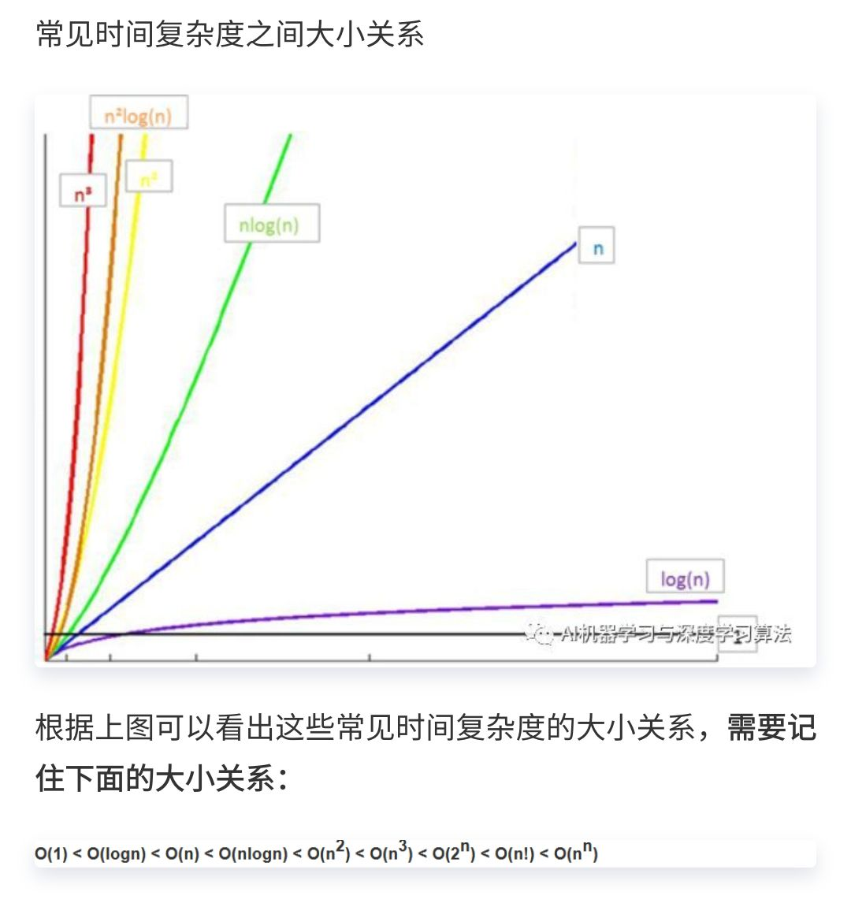

1. 计算的是最坏情况
2. 看点
   1. `for`循环，有几层就有`n`几次方
   2. 有没有二分的过程，有一次就是一个`logn`
3. 写法
   1. `大O表示法`：$O(1)<O(\log n)<O(n)<O(n\log n)<O(n^2)<O(n^3)<O(2^n)<O(n!)<O(n^n)$
   2. $n$要小写
   3. $\log$一般不用写$2$

**时间复杂度对应算法：**

1. $O(n_a+n_b)$：两有序表合并
2. $O(n+k)$：桶排序、计数排序
3. $O(nk)$：基数排序
4. $O(n\log n)$：快速排序、堆排序、归并排序
5. $O(n^2)$：冒泡排序、选择排序、（希尔排序）