# 数据结构复习笔记

## 线性表

### 概念

线性表包括：

1. 顺序表：线性表的顺序表示
2. 单链表：线性表的指针实现
3. 栈：线性表的特殊形式，只对表尾操作

### 顺序表

**动态分配方法：**

1. 初始分配空间（100）
2. 分配增量（10）
3. 可以用`realloc`更新基址来增大大小

**平均查找长度**：插入/删除一个数据元素平均移动表内一半元素

**查找时间复杂度：**


### 单链表


**特殊概念：**

1. 头结点（首节点）：第一个储存数据的节点，通常不储存信息
2. 第一个节点：指内存中储存的第一个位置的节点，可能是头结点也可不是。被**头指针**指向。
3. 头指针：指向**第一个节点**的指针

**时间复杂度：**

1. 插入和删除都是`O(1)`
2. 查找是`O(n)`
3. 合并算法`O(m+n)`或者`O(max(m, n))`

**空间复杂度：**

1. 插入删除都是`O(1)`
2. 两个有序的链表合并得到一个有序链表是`O(1)`，而对于顺序表为`O(m+n)`

**链表逆序算法：**实际就是从头到尾遍历，对遍历到的节点再用头插法插入头指针，时间`O(n)`，空间`O(1)`。


**判断链表是否有环：**快慢指针法

**线性链表，求倒数第K个数：**两个指针相差k，同时向后移动

**线性链表，求中间位置的元素：**前面指针移动速度是后面指针的两倍

**单向链表交叉问题：** 调整两个指针同时从两条链表出发，并且使得到链表尾部的长度相等

### 静态链表

借助数组实现静态的链表。


### 双向链表

### 环形链表


### 综合

**静态储存与动态储存**


**链表优缺点**


## 栈和队列

### 栈

**描述：**限定只在表尾进行插入和删除操作的线性表。后进先出（`LIFO`）结构。

**结构**

1. 顺序储存
   1. 
   2. 这里约定了栈顶`top`指向栈顶元素，而不是栈顶的下一个元素
   3. 栈是否为空，按照这个约定则为`top == 0`
2. 链式储存
3. 共享栈
   1. 

**为什么要设计栈**


**栈的不可能出现的输出序列**


**汉诺塔问题**


**进制转换**


**表达式求值**

1. 种类：
2. 高级语言中，采用类似自然语言的中缀表达式，但计算机 对中缀表达式的处理是很困难的，而对后缀或前缀表达式则显得非常简单。

### 队列

队列是对线性表的插入和删除操作加以限定的另一种限定型数据结构。

**假溢出：**


**队列的应用**


### 串

#### 模式匹配算法

**枚举法**

1. 最好情况下，最开头的字符失配，平均`O(m+n)`
2. 最坏情况，最后一个字符失陪配，平均`O(m*n)`

**KMP算法**

```cpp
void cal_next(char *str, int *next, int len) {
  next[0] = -1;  // next[0]初始化为-1，-1表示不存在相同的最大前缀和最大后缀
  int k = -1;  // k初始化为-1
  for (int q = 1; q <= len - 1; q++) {
    // 如果下一个不同，那么k就变成next[k]，
    // 注意next[k]是小于k的，无论k取任何值。
    while (k > -1 && str[k + 1] != str[q]) {
      k = next[k];  //往前回溯
    }
    if (str[k + 1] == str[q]) {  //如果相同，k++
      k = k + 1;
    }
    next[q] = k;
    // 这个是把算的k的值（就是相同的最大前缀和最大后缀长）赋给next[q]
  }
}
int KMP(char *str, int slen, char *ptr, int plen) {
  int *next = new int[plen];
  cal_next(ptr, next, plen);  //计算next数组
  int k = -1;
  for (int i = 0; i < slen; i++) {
    // ptr和str不匹配，且k>-1（表示ptr和str有部分匹配）
    while (k > -1 && ptr[k + 1] != str[i]) k = next[k];  //往前回溯
    if (ptr[k + 1] == str[i]) k = k + 1;
    if (k == plen - 1) {
      // 说明k移动到ptr的最末端
      // cout << "在位置" << i-plen+1<< endl;
      // k = -1;  //重新初始化，寻找下一个
      // i = i - plen + 1;
      // i定位到该位置，外层for循环i++可以继续找下一个
      // （这里默认存在两个匹配字符串可以部分重叠）
      return i - plen + 1;  //返回相应的位置
    }
  }
  return -1;
}
```

### 数组

#### 数组的压缩储存

**特殊矩阵**

1. 对称矩阵
2. 带状矩阵
3. 稀疏矩阵
   1. 稀疏矩阵三元组求转置
   2. 数组的链接式储存：

### 广义表

广义表是线性表的一种推广结构，线性表要求是相同的数据元素，而广义表中的<u>元素可以取不同类型</u>，可以是最基本的不可再分割的“原子”，也可以是广义表本身。广义表是由<u>零个原子，或若干个原子或若干个广义表组成的有穷序列</u>。

**结论：**

**操作：**


**储存结构**


### 线性表总结


## 树

### 二叉树

#### 性质/概念

1. 在二叉树中第$i$层的结点数最多为$2^{i-1}$（$i \ge 1$）。

2. 高度为$k$的二叉树其结点总数最多为$2^{k－1}$（$k \ge 1$）。

3. 对于任意非空二叉树，`叶子节点数量 = 度数为2的节点数量 + 1`
   $$
   n_0 = n_2 + 1
   $$

4. 满二叉树：深度为$k$且有$2^k-1$个节点的树。（属于特殊的完全二叉树）

5. 完全二叉树：深度为$k$的，有$n$个结点的二叉树，当且仅当其每个 结点都与深度为$k$的满二叉树中编号从$1$至$n$的结点一一对应， 称之为完全二叉树。

   1. 具有 n 个结点的完全二叉树的深度为$\lfloor \log_2n \rfloor + 1$。

6. n 个结点的二叉树中，共有 n+1 个空链接域

#### 遍历

**原则：**左孩子结点一 定要在右孩子结点之前被访问。

**由两个遍历顺序确定二叉树**

1. 先序+后序不能确定一棵二叉树：

   > 中序遍历可以与前序遍历、后序遍历和层次遍历中的任意一个来构建唯一的二叉树，而后三者两两搭配或者是三个一起上都无法创建一颗唯一的一颗二叉树，原因是先序、后序、层次遍历均是提供根节点，作用是相同的，都必须<u>由中序遍历来区分出左子树与右子树</u>，所以中序遍历与后序遍历可以唯一确定一棵二叉树

2. 方法

   1. 先找中序遍历，从而找出当前子树的根
   2. 分出左右子树
   3. 递归调用

**二叉树遍历的非递归过程**


#### 线索二叉树

### 堆

如果一棵完全二叉树的任意一个非终端结点的元素都不小于其左儿子结点和右儿子结点（如果有的话）的元素， 则称此完全二叉树为最大堆。 同样，如果一棵完全二叉树的任意一个非终端结点的 元素都不大于其左儿子结点和右儿子结点（如果有的话） 的元素，则称此完全二叉树为最小堆。

**特点：**

### 哈夫曼树

**作用：**提高数据传输效率（数据压缩）

**特点：**权最小的增长树

**创建方法**

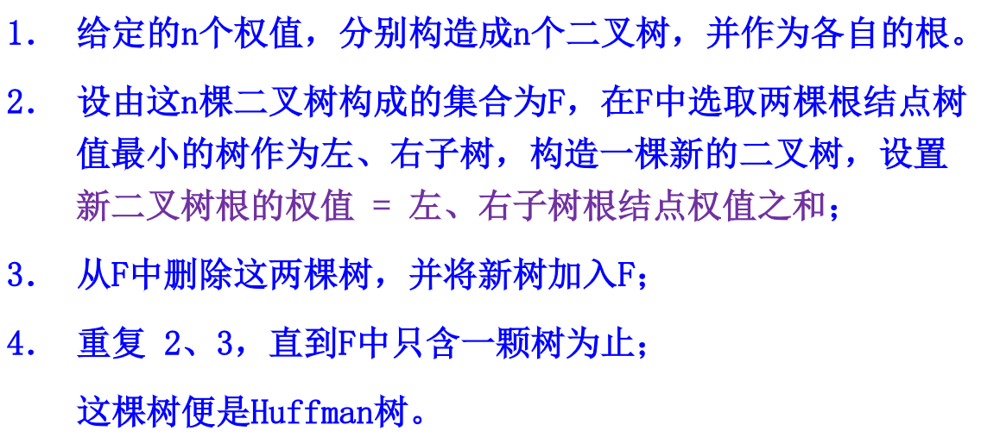

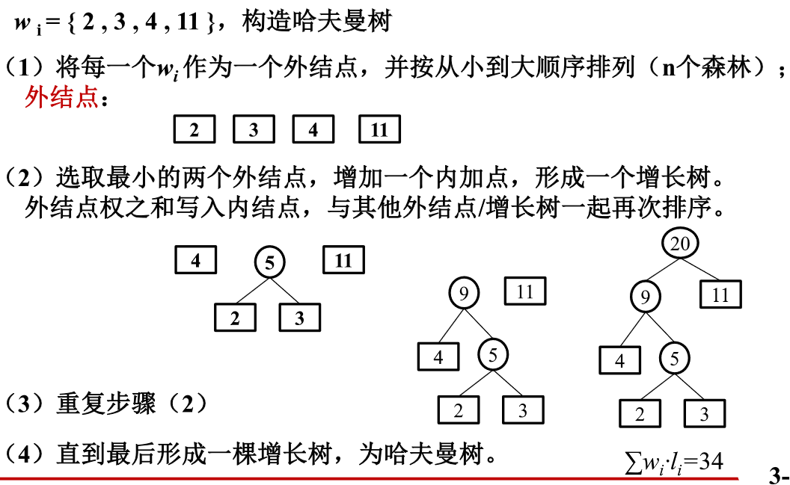

**前缀编码**

## 图

### 基本概念

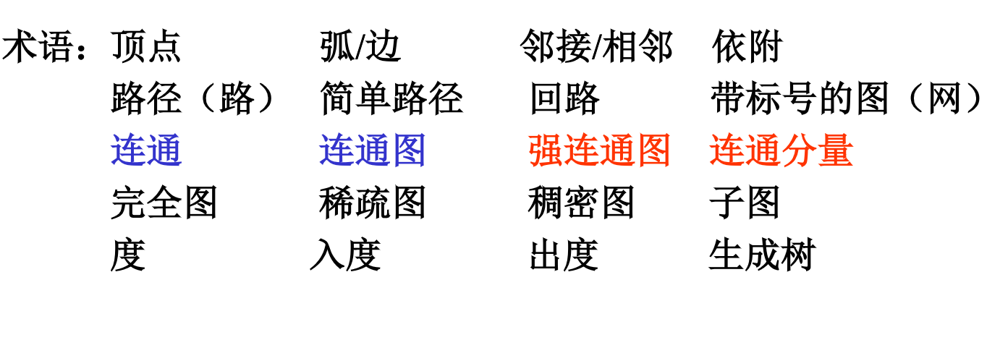

**连通分量：**连通分量指的是一**幅图中所有极大连通子图**。任何连通图的连通分量只有一个，即是其自身，非连通的无向图有多个连通分量。无向图 G **的一个极大连通子图**称为 G 的一个连通分量（或连通分支）

**网and子图**：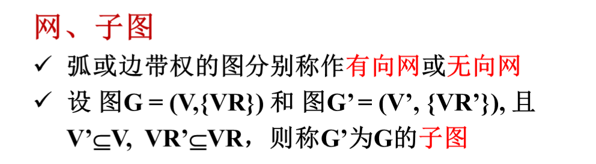

### 储存结构和基本操作

#### 邻接矩阵

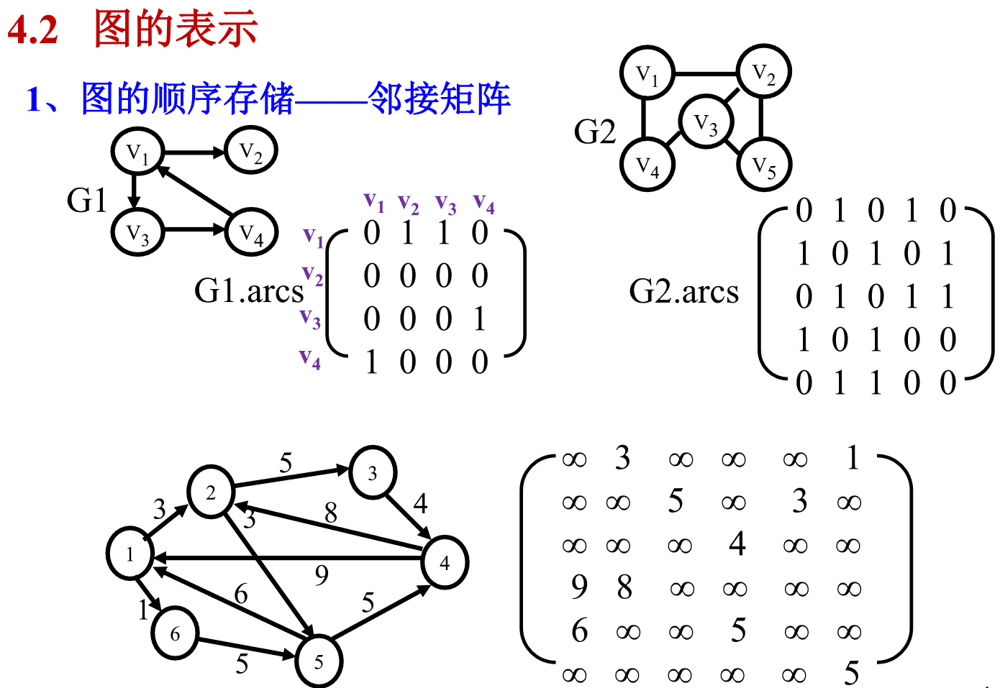

#### 邻接表

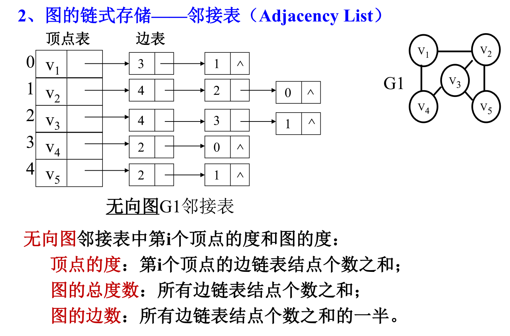

**空间复杂度：**无向图：$O(|V|+2|E|)$；有向图：$O(|V|+|E|)$；

**有向图的十字链表表示**（类似数组的链式表示）

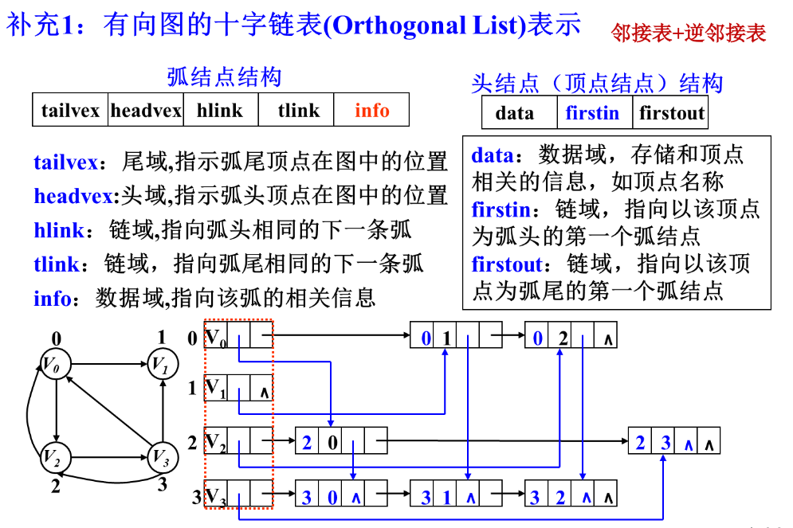


### 图的遍历

**DFS：**深度优先搜索

**BFS：**广度优先搜索

**二者比较：**

1. 时间复杂度都是$O(v+e)$
2. DFS比较适合判断图中是否有环，寻找两个节点之间的路径，有向无环图（DAG）的拓扑排序，寻找所有强连通片（SCC），无向图中寻找割点和桥等；
3. BFS则比较适合判断二分图，以及用于实现寻找最小生成树（MST），如在BFS基础上的Kruskal算法。还有寻找最短路径问题（如Dijkstra算法）。

### 算法and应用

#### 最小生成树

**Prim算法**

引入集合U和T。U准备结点集，T为树边集。初值U={1}，T=￠。选择有最小权的边(u,v)，使u∈U,v∈(V-U),将v加入U,（u,v）加入T。重复这一过程，直到U=V。

简称“*加点法*”，即每次从已经选择的点的相关点中选取最短最近的点。

**Kruskal算法**

简称“加边法”，即每次从已经选定的边的所有相关边中选定最短的边，加入已经选定的集合中。

**两者比较**

1. 都是贪心算法

2. Kruskal算法在效率上总体上要比Prim算法快，因为Kruskal只需要对权重边做一次排序，而Prim算法则需要做多次排序。

   时间复杂度：Prim: $O(n^2)$，Kruskal: $O(e\log e)$。

3. Prim算法是挨个找，而Kruskal是先排序再找

4. 稀疏图可以用Kruskal，因为Kruskal算法每次查找最短的边。稠密图可以用Prim，因为它是每次加一个顶点，对边数多的适用。

### 拓扑排序

**算法**：每次选定入度为零的点并且删除该点，并且更新相关点的入度，选定点顺序则为拓扑排序顺序。

### 关键路径

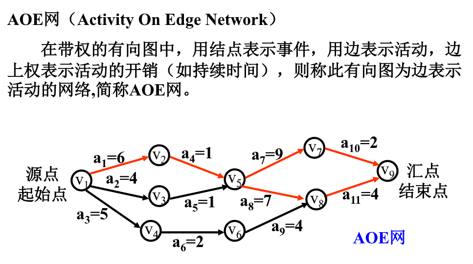

**概念**

1. 路径长度：是指从源点到汇点路径上所有活动的持续时间之和
2. 关键路径：在AOE网中，由于有些活动可以并行，所以完成工程的最短时间是从源点到汇点的最大路径长度。因此，把从源点到汇点具有<u>最大长度的路径</u>称为关键路径。
3. 一个AOE中，关键路径可能不只一条
4. 关键活动：关键路径上的活动称为关键活动
5. 顶点$\iff$事件，边$\iff$活动

**算法：**

1. 几个描述量

   1. 事件$V_j$最早可能发生时间$VE(j)$：源点到顶点$V_j$的最长路径长度

   2. 活动$a_i$的最早可能开始时间$E(k)$：$a_i$在$<V_j, V_k>$上，则$E(i)$也是从源点$V_1$到顶点$V_j$的最长路径长度。这是因为事件$V_j$发生表明以$V_j$为起点的所有活动$a_i$可以立即开始。
      $$
      E(i) = VE(k)
      $$

   3. 事件$V_k$最迟发生时间$VL(k)$：等于汇点的最早发生时间$VE(n)$减去从$V_k$到$V_n$的最大路径长度

   4. 活动$a_i$最迟允许开工时间$L(i)$：活动$a_i$的最迟开始时间$L(i)$应该是$a_i$的最迟完成时间$VL(k)$减去$a_i$的持续时间
      $$
      L(i) = VL(k) -ACT[j][k]
      $$

   5. 时间余量$L(i) - E(i)$：最早可能开始时间和最迟允许开始时间的时间余量。关键路径上的活动都是$L(i) = E(i)$，表示这些活动没有时间余量

2. 前进阶段：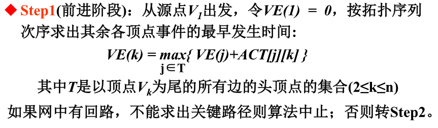

3. 回退阶段：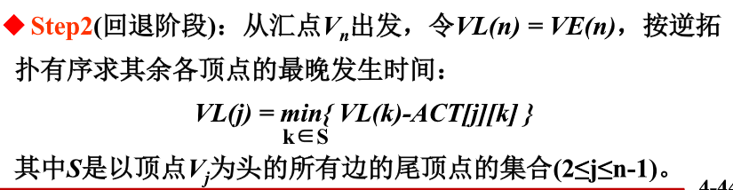

4. 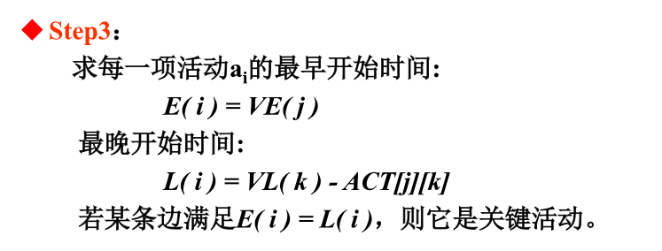

5. 示例

   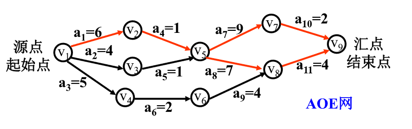

   1. $VE(1) = 0$，$VE(2) = VE(1)+ACT[2][1] = 6$，$VE(3) = \cdots = 4$，$VE(4) = 5$；

      $VE(5)=\max\{6+1,4+1\}=7$，$VE(6)=7$，$VE(7)=16$，$VE(8)=\max\{7+7,7+4\}=14$，

      $VE(9)=\max\{16+2,14+4\}=18$

   2. $VL(9)=VE(9)=18$，$VL(7)=16$，$VL(8)=14$，$VL(6)=10$，$VL(5)=\min\{16-9,14-7\}=7$，$VL(4)=8$，$VL(3)=6$，$VL(2)=6$，$VL(1)=\min\{6-6, 6-4\}=0$

### 单源最短路径

#### Dijkstra

1. 初始化：集合$S$初始值为$\{源点\}$，距离数组$D[]$初始化为源点到各顶点目前最短路径

2. loop直到$S$包含所有节点

   1. 从$S$不包含的节点选择一个节点$w$，使得$D[w]$的值最小，并且将$w$加入$S$

   2. 调整距离数组$D[]$以保证当前状态是源点到各个顶点最短距离：
      $$
      D[k]=\min\{D[k], D[w]+C[w][k]\}
      $$

**时间复杂度：**

- 上限为$O(n_2)$（朴素）
- $O((n+m)\log_2n)$（堆优化）

**适用情况：**

1. 适用于稠密图
2. 计算单源最短无负边路径
3. 可以存在环

#### Floyd

**步骤**

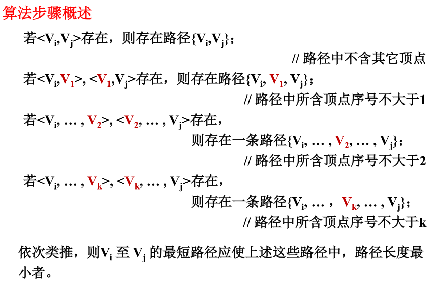

**核心：**对每一对$V_i, V_j$
$$
A_k[i][j] = \min\{A_{k-1}[i][j], A_{k-1}[i][k] + A_{k-1}[k][j]\}
$$
适用范围：求非负无环图每两个顶点之间的最短距离

**时间复杂度：**$O(n^3)$

## 查找算法

### 折半查找

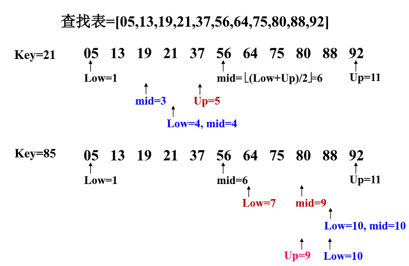

时间复杂度：$ASL = \log_2(n+1)-1$，$O(\log n)$

**链表上的折半查找**：需要建立$2^n$单位的索引

### 分块查找

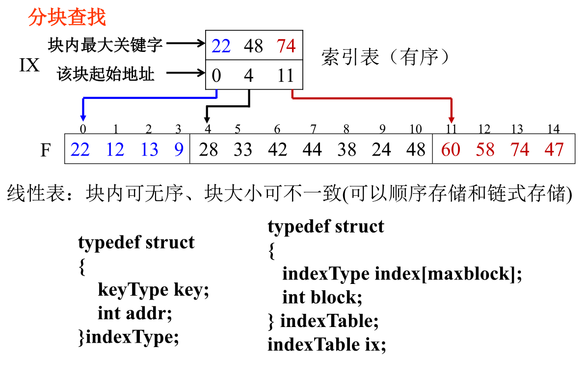

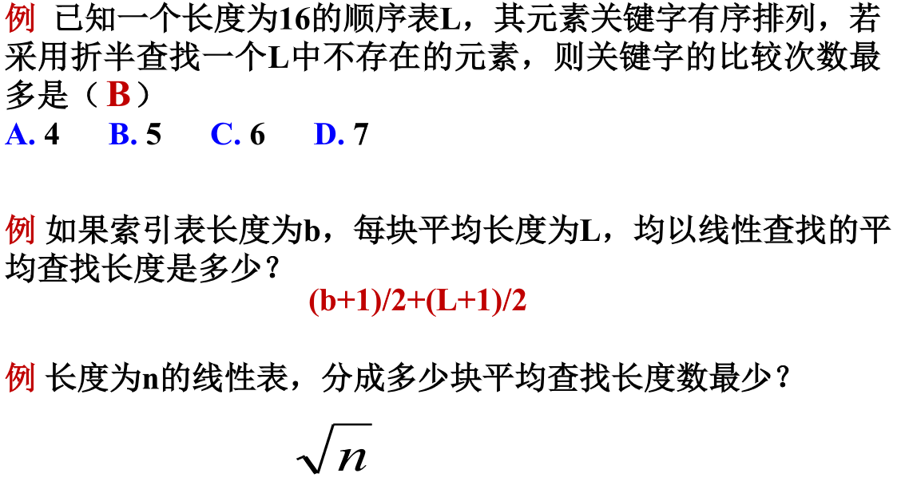

> <span style="color: red">例题1</span>
>
> | 1    | 2    | 3    | 4    | 5    | 6    | 7    | 8    | 9    | 10   | 11   | 12   | 13   | 14   | 15   | 16   |
> | ---- | ---- | ---- | ---- | ---- | ---- | ---- | ---- | ---- | ---- | ---- | ---- | ---- | ---- | ---- | ---- |
> | (4)  | (3)  | (4)  | (2)  | (4)  | (3)  | (4)  | (1)  | (4)  | (3)  | (4)  | (2)  | (4)  | (3)  | (4)  | (5)  |
> |      |      |      |      |      |      |      |      |      |      |      |      |      |      |      | ↑    |
>
> > 关键字1，6，9，12，13，18，21，23，25对其进行折半查找，其平均查找长度ASL为：`______________`，查找值为21的结点，需要比较`_______`次。
>
> | 1    | 2    | 3    | 4    | 5    | 6    | 7    | 8    | 9    |
> | ---- | ---- | ---- | ---- | ---- | ---- | ---- | ---- | ---- |
> | 1    | 6    | 9    | 12   | 13   | 18   | 21   | 23   | 25   |
> |      |      |      |      | (1)  |      |      |      |      |
> |      | (2)  |      |      |      |      | (2)  |      |      |
> | (3)  |      | (3)  |      |      | (3)  |      | (3)  |      |
> |      |      |      | (4)  |      |      |      |      | (4)  |

### AVL树

**性质：**

1. 左右子树都是高度平衡的二叉树
2. 左右子树高度的差(BF)的绝对值不超过1

**插入操作：**

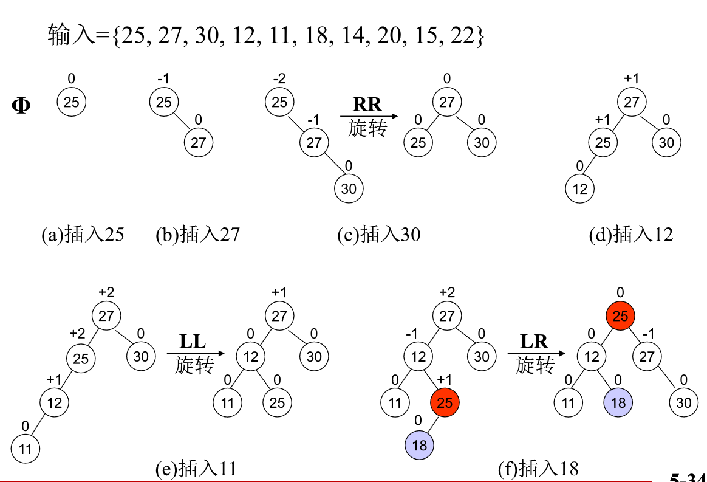

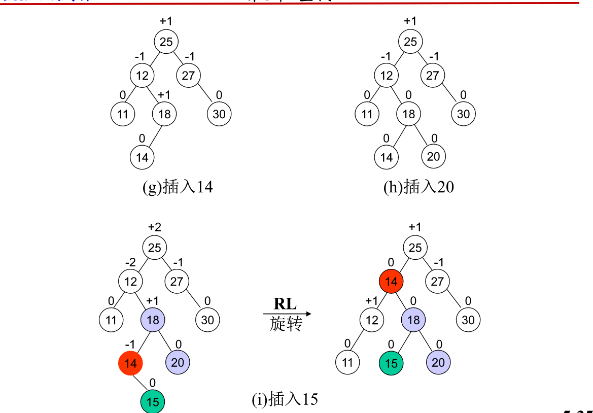

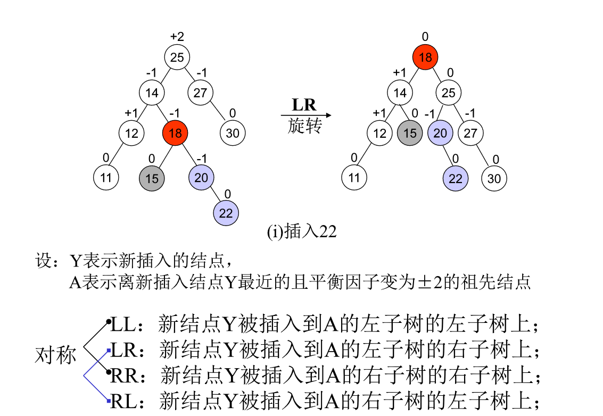

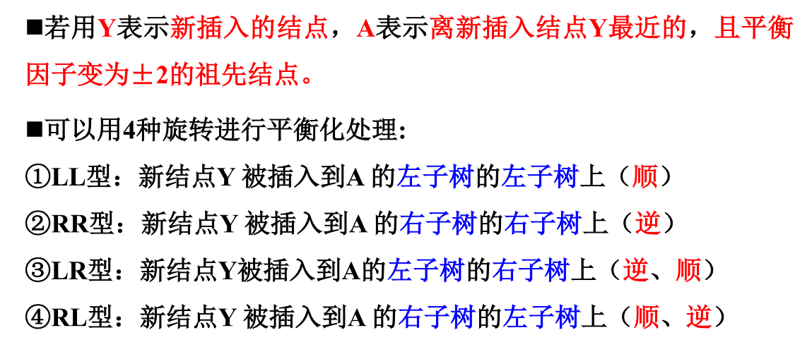

### B树和B+树

### 散列表

### 查找算法分析和应用

## 排序算法

### 相关概念

**稳定**：如果a原本在b前面，而a=b，排序之后a仍然在b的前面。

**不稳定**：如果a原本在b的前面，而a=b，排序之后 a 可能会出现在 b 的后面。

**时间复杂度：**一般情况下，算法中<u>基本操作重复执行的次数</u>是问题规模n的某个函数，用T(n)表示，若有某个辅助函数f(n),使得当n趋近于无穷大时，T（n)/f(n)的极限值为不等于零的常数，则称f(n)是T(n)的同数量级函数。记作T(n)=Ｏ(f(n)),称Ｏ(f(n)) 为算法的渐进时间复杂度，简称时间复杂度。
上面这一段解释是很规范的，但是对于非专业性的我们来说并不是那么好理解，说白了时间复杂度就是时间复杂度的计算<u>并不是计算程序具体运行的时间，而是算法执行语句的次数</u>。通常我们计算时间复杂度都是计算最坏情况 。
**最坏时间复杂度和平均时间复杂度**：
最坏情况下的时间复杂度称最坏时间复杂度。一般不特别说明，讨论的时间复杂度均是最坏情况下的时间复杂度。
这样做的原因是：最坏情况下的时间复杂度是算法在任何输入实例上运行时间的上界，这就保证了算法的运行时间不会比任何更长。
**平均时间复杂度：**是指所有可能的输入实例均以等概率出现的情况下，算法的期望运行时间。设每种情况的出现的概率为pi,平均时间复杂度则为sum(pi*f(n))

分作**两大类**：

> **非线性时间比较类排序**：通过<u>比较</u>来决定元素间的相对次序，由于其时间复杂度<u>不能突破O(nlogn)</u>，因此称为非线性时间比较类排序。
>
> **线性时间非比较类排序**：<u>不通过比较</u>来决定元素间的相对次序，它可以突破基于比较排序的时间下界，以线性时间运行，因此称为线性时间非比较类排序。 


### 时间复杂度分析


1. 计算的是最坏情况
2. 看点
   1. `for`循环，有几层就有`n`几次方
   2. 有没有二分的过程，有一次就是一个`logn`
3. 写法
   1. `大O表示法`：$O(1)<O(\log n)<O(n)<O(n\log n)<O(n^2)<O(n^3)<O(2^n)<O(n!)<O(n^n)$
   2. $n$要小写
   3. $\log$一般不用写$2$

**时间复杂度对应算法：**

1. $O(n_a+n_b)$：两有序表合并
2. $O(n+k)$：桶排序、计数排序
3. $O(nk)$：基数排序
4. $O(n\log n)$：快速排序、堆排序、归并排序
5. $O(n^2)$：冒泡排序、选择排序、（希尔排序）

## 一些问题

### 原地合并？

